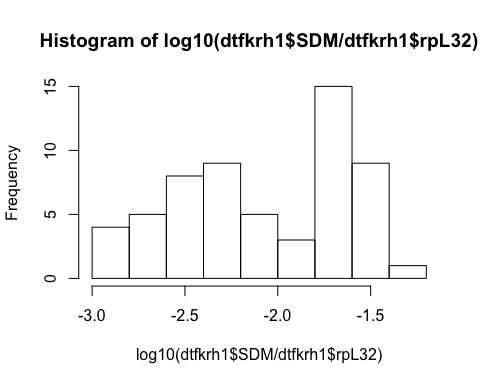
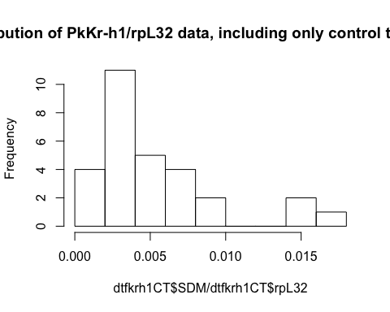

# Supplementary text: Materials and Methods - Statistical analyses for JHM treatments (A case of insect female neoteny: E93 expression and links to the juvenile hormone in mealybugs)
Isabelle Vea  
September 28, 2017  


#Summary
You will find here all the analyses related to the statistics of hormonal treatments carried out in Vea et al. (submitted to Journal of Insect Biochemistry and Molecular Biology). 


```r
setwd("/Users/isabelle/Dropbox/_Github_reps/E93/")
library(ggplot2)
library(plyr)
library(tidyr)
```


#Effect of pyriproxyfen treatment
##Data

```r
#loading file JHM treatment
#females
dtf<-read.csv(file="E93-Pyr-N3D0.csv",header = TRUE)
names(dtf)
```

```
##  [1] "cDNA.."          "Compound"        "treatment.stage"
##  [4] "sex"             "Day"             "DayL"           
##  [7] "N"               "rpL32"           "Kr.h1"          
## [10] "E93"             "PkE93.1"         "PkE93.2"        
## [13] "PkE93.3"         "br.1"            "br.2"           
## [16] "br.3"
```

```r
head(dtf)
```

```
##   cDNA.. Compound treatment.stage    sex Day DayL N   rpL32    Kr.h1
## 1    203  Control            N3D0 female   1    A 1 0.00281 4.22e-05
## 2    204  Control            N3D0 female   1    A 1 0.00405 6.70e-05
## 3    205  Control            N3D0 female   1    A 1 0.01160 9.58e-05
## 4    206  Control            N3D0 female   1    A 1 0.00519 7.69e-05
## 5    207    Mimic            N3D0 female   1    A 1 0.00281 9.39e-05
## 6    209    Mimic            N3D0 female   1    A 1 0.00161 3.51e-06
##        E93  PkE93.1  PkE93.2  PkE93.3     br.1     br.2     br.3
## 1 9.75e-06 1.77e-06 3.33e-07 6.94e-08 1.29e-06 3.91e-05 6.71e-05
## 2 1.81e-05 1.85e-06 3.36e-07 9.38e-08 1.01e-06 3.33e-05 2.80e-05
## 3 3.81e-05 5.16e-06 1.08e-06 1.44e-07 5.26e-06 8.94e-05 1.29e-04
## 4 2.78e-05 3.62e-06 5.92e-07 1.67e-07 4.03e-06 3.94e-05 9.86e-05
## 5 4.46e-05 1.59e-05 1.08e-06 2.39e-08 2.19e-06 1.28e-05 8.69e-05
## 6 4.14e-06 5.95e-07 1.22e-07 1.00e-07 6.68e-08 5.51e-06 4.13e-06
```

```r
dtf<-gather(dtf,Gene,SDM,9:16)
#dtf
head(dtf)
```

```
##   cDNA.. Compound treatment.stage    sex Day DayL N   rpL32  Gene      SDM
## 1    203  Control            N3D0 female   1    A 1 0.00281 Kr.h1 4.22e-05
## 2    204  Control            N3D0 female   1    A 1 0.00405 Kr.h1 6.70e-05
## 3    205  Control            N3D0 female   1    A 1 0.01160 Kr.h1 9.58e-05
## 4    206  Control            N3D0 female   1    A 1 0.00519 Kr.h1 7.69e-05
## 5    207    Mimic            N3D0 female   1    A 1 0.00281 Kr.h1 9.39e-05
## 6    209    Mimic            N3D0 female   1    A 1 0.00161 Kr.h1 3.51e-06
```

```r
#males
dtm<-read.csv(file="E93-Pyr-male.csv",header = TRUE)
names(dtm)
```

```
## [1] "Sample.ID" "treatment" "Day"       "DayL"      "Gene"      "SDM.Gene" 
## [7] "SDM.rpL32"
```

```r
head(dtm)
```

```
##   Sample.ID treatment Day DayL  Gene SDM.Gene SDM.rpL32
## 1       299   Control   1    A Kr-h1 3.91e-05   0.00116
## 2       300   Control   2    B Kr-h1 1.05e-05   0.00148
## 3       301   Control   3    C Kr-h1 2.82e-06   0.00221
## 4       302   Control   4    D Kr-h1 3.03e-06   0.00206
## 5       303   Control   4    D Kr-h1 7.78e-06   0.00238
## 6       304     Mimic   4    D Kr-h1 1.50e-04   0.00197
```

##Checking for data distribution 

```r
#female dataset subsetting to keep Kr-h1 and E93 1 and 2 subset from D4 to D8
dtf<-subset(dtf, Gene=="Kr.h1" | Gene=="PkE93.1"| Gene=="PkE93.2"| Gene=="PkE93.3")
dtf<-subset(dtf, Day == 4 |Day == 5 |Day == 6 |Day == 7 |Day == 8 )
dtf$Gene
```

```
##   [1] "Kr.h1"   "Kr.h1"   "Kr.h1"   "Kr.h1"   "Kr.h1"   "Kr.h1"   "Kr.h1"  
##   [8] "Kr.h1"   "Kr.h1"   "Kr.h1"   "Kr.h1"   "Kr.h1"   "Kr.h1"   "Kr.h1"  
##  [15] "Kr.h1"   "Kr.h1"   "Kr.h1"   "Kr.h1"   "Kr.h1"   "Kr.h1"   "Kr.h1"  
##  [22] "Kr.h1"   "Kr.h1"   "Kr.h1"   "Kr.h1"   "Kr.h1"   "Kr.h1"   "Kr.h1"  
##  [29] "Kr.h1"   "Kr.h1"   "Kr.h1"   "Kr.h1"   "Kr.h1"   "Kr.h1"   "Kr.h1"  
##  [36] "Kr.h1"   "Kr.h1"   "Kr.h1"   "Kr.h1"   "PkE93.1" "PkE93.1" "PkE93.1"
##  [43] "PkE93.1" "PkE93.1" "PkE93.1" "PkE93.1" "PkE93.1" "PkE93.1" "PkE93.1"
##  [50] "PkE93.1" "PkE93.1" "PkE93.1" "PkE93.1" "PkE93.1" "PkE93.1" "PkE93.1"
##  [57] "PkE93.1" "PkE93.1" "PkE93.1" "PkE93.1" "PkE93.1" "PkE93.1" "PkE93.1"
##  [64] "PkE93.1" "PkE93.1" "PkE93.1" "PkE93.1" "PkE93.1" "PkE93.1" "PkE93.1"
##  [71] "PkE93.1" "PkE93.1" "PkE93.1" "PkE93.1" "PkE93.1" "PkE93.1" "PkE93.1"
##  [78] "PkE93.1" "PkE93.2" "PkE93.2" "PkE93.2" "PkE93.2" "PkE93.2" "PkE93.2"
##  [85] "PkE93.2" "PkE93.2" "PkE93.2" "PkE93.2" "PkE93.2" "PkE93.2" "PkE93.2"
##  [92] "PkE93.2" "PkE93.2" "PkE93.2" "PkE93.2" "PkE93.2" "PkE93.2" "PkE93.2"
##  [99] "PkE93.2" "PkE93.2" "PkE93.2" "PkE93.2" "PkE93.2" "PkE93.2" "PkE93.2"
## [106] "PkE93.2" "PkE93.2" "PkE93.2" "PkE93.2" "PkE93.2" "PkE93.2" "PkE93.2"
## [113] "PkE93.2" "PkE93.2" "PkE93.2" "PkE93.2" "PkE93.2" "PkE93.3" "PkE93.3"
## [120] "PkE93.3" "PkE93.3" "PkE93.3" "PkE93.3" "PkE93.3" "PkE93.3" "PkE93.3"
## [127] "PkE93.3" "PkE93.3" "PkE93.3" "PkE93.3" "PkE93.3" "PkE93.3" "PkE93.3"
## [134] "PkE93.3" "PkE93.3" "PkE93.3" "PkE93.3" "PkE93.3" "PkE93.3" "PkE93.3"
## [141] "PkE93.3" "PkE93.3" "PkE93.3" "PkE93.3" "PkE93.3" "PkE93.3" "PkE93.3"
## [148] "PkE93.3" "PkE93.3" "PkE93.3" "PkE93.3" "PkE93.3" "PkE93.3" "PkE93.3"
## [155] "PkE93.3" "PkE93.3"
```

```r
dtf$Day
```

```
##   [1] 4 4 4 4 4 4 5 5 5 5 5 5 6 6 6 6 6 6 7 7 7 7 7 7 8 8 8 8 8 8 8 8 8 8 8
##  [36] 8 8 8 8 4 4 4 4 4 4 5 5 5 5 5 5 6 6 6 6 6 6 7 7 7 7 7 7 8 8 8 8 8 8 8
##  [71] 8 8 8 8 8 8 8 8 4 4 4 4 4 4 5 5 5 5 5 5 6 6 6 6 6 6 7 7 7 7 7 7 8 8 8
## [106] 8 8 8 8 8 8 8 8 8 8 8 8 4 4 4 4 4 4 5 5 5 5 5 5 6 6 6 6 6 6 7 7 7 7 7
## [141] 7 8 8 8 8 8 8 8 8 8 8 8 8 8 8 8
```


###Female dataset for PkKr-h1

```r
#all female dataset Kr-h1
dtfkrh1<-subset(dtf, Gene=="Kr.h1")
dtfkrh1$Gene
```

```
##  [1] "Kr.h1" "Kr.h1" "Kr.h1" "Kr.h1" "Kr.h1" "Kr.h1" "Kr.h1" "Kr.h1"
##  [9] "Kr.h1" "Kr.h1" "Kr.h1" "Kr.h1" "Kr.h1" "Kr.h1" "Kr.h1" "Kr.h1"
## [17] "Kr.h1" "Kr.h1" "Kr.h1" "Kr.h1" "Kr.h1" "Kr.h1" "Kr.h1" "Kr.h1"
## [25] "Kr.h1" "Kr.h1" "Kr.h1" "Kr.h1" "Kr.h1" "Kr.h1" "Kr.h1" "Kr.h1"
## [33] "Kr.h1" "Kr.h1" "Kr.h1" "Kr.h1" "Kr.h1" "Kr.h1" "Kr.h1"
```

```r
hist(dtfkrh1$SDM/dtfkrh1$rpL32, main="Distribution of all data  PkKr-h1/rpL32, regardless of treatment type")#not normal
```

<!-- -->

The distribution of qPCR data collected for relative expression of PkKr-h1 is nor normal. We decided to transform the data to log10.


```r
  #log transformed
hist(log10(dtfkrh1$SDM/dtfkrh1$rpL32)) #more or less normal
```

<!-- -->

We also checked data distribution by treatment


```r
#by treatment
dtfkrh1CT<-subset(dtfkrh1,Compound=="Control")
dtfkrh1CT$Compound
```

```
##  [1] Control Control Control Control Control Control Control Control
##  [9] Control Control Control Control Control Control Control Control
## [17] Control Control Control
## Levels: Control Mimic
```

```r
dtfkrh1JHM<-subset(dtfkrh1,Compound=="Mimic")
dtfkrh1JHM$Compound
```

```
##  [1] Mimic Mimic Mimic Mimic Mimic Mimic Mimic Mimic Mimic Mimic Mimic
## [12] Mimic Mimic Mimic Mimic Mimic Mimic Mimic Mimic Mimic
## Levels: Control Mimic
```

```r
hist(dtfkrh1CT$SDM/dtfkrh1CT$rpL32, main="Distribution of   PkKr-h1/rpL32 data, including only control treatments")
```

<!-- -->

```r
hist(dtfkrh1JHM$SDM/dtfkrh1JHM$rpL32, main="Distribution of   PkKr-h1/rpL32 data, including only mimic treatments")
```

<!-- -->

```r
  #log transformed
hist(log10(dtfkrh1CT$SDM/dtfkrh1CT$rpL32)) #ok
```

<!-- -->

```r
hist(log10(dtfkrh1JHM$SDM/dtfkrh1JHM$rpL32)) #skewed normal
```

<!-- -->


```r
#all female dataset E93 1
dtfE931<-subset(dtf, Gene=="PkE93.1")
dtfE931$Gene
```

```
##  [1] "PkE93.1" "PkE93.1" "PkE93.1" "PkE93.1" "PkE93.1" "PkE93.1" "PkE93.1"
##  [8] "PkE93.1" "PkE93.1" "PkE93.1" "PkE93.1" "PkE93.1" "PkE93.1" "PkE93.1"
## [15] "PkE93.1" "PkE93.1" "PkE93.1" "PkE93.1" "PkE93.1" "PkE93.1" "PkE93.1"
## [22] "PkE93.1" "PkE93.1" "PkE93.1" "PkE93.1" "PkE93.1" "PkE93.1" "PkE93.1"
## [29] "PkE93.1" "PkE93.1" "PkE93.1" "PkE93.1" "PkE93.1" "PkE93.1" "PkE93.1"
## [36] "PkE93.1" "PkE93.1" "PkE93.1" "PkE93.1"
```

```r
hist(dtfE931$SDM/dtfE931$rpL32) #distribution not normal
```

<!-- -->

```r
  #log transformed
hist(log10(dtfE931$SDM/dtfE931$rpL32) )
```

<!-- -->

```r
#by treatment
dtfE931CT<-subset(dtfE931,Compound=="Control")
dtfE931CT$Compound
```

```
##  [1] Control Control Control Control Control Control Control Control
##  [9] Control Control Control Control Control Control Control Control
## [17] Control Control Control
## Levels: Control Mimic
```

```r
dtfE931JHM<-subset(dtfE931,Compound=="Mimic")
dtfE931JHM$Compound
```

```
##  [1] Mimic Mimic Mimic Mimic Mimic Mimic Mimic Mimic Mimic Mimic Mimic
## [12] Mimic Mimic Mimic Mimic Mimic Mimic Mimic Mimic Mimic
## Levels: Control Mimic
```

```r
hist(dtfE931CT$SDM/dtfE931CT$rpL32) #not normal
```

<!-- -->

```r
hist(dtfE931JHM$SDM/dtfE931JHM$rpL32)
```

<!-- -->

```r
  #log transformed
hist(log10(dtfE931CT$SDM/dtfE931CT$rpL32)) #two peaks
```

<!-- -->

```r
hist(log10(dtfE931JHM$SDM/dtfE931JHM$rpL32)) #weird!
```

<!-- -->

```r
#male dataset subset Krh1 and E93 1
head(dtm)
```

```
##   Sample.ID treatment Day DayL  Gene SDM.Gene SDM.rpL32
## 1       299   Control   1    A Kr-h1 3.91e-05   0.00116
## 2       300   Control   2    B Kr-h1 1.05e-05   0.00148
## 3       301   Control   3    C Kr-h1 2.82e-06   0.00221
## 4       302   Control   4    D Kr-h1 3.03e-06   0.00206
## 5       303   Control   4    D Kr-h1 7.78e-06   0.00238
## 6       304     Mimic   4    D Kr-h1 1.50e-04   0.00197
```

```r
#subsetting Kr-h1 and E93 1
dtm<-subset(dtm, Gene=="Kr-h1" | Gene=="PkE93-1"| Gene=="PkE93-2"| Gene=="PkE93-3")
dtm$Gene
```

```
##   [1] Kr-h1   Kr-h1   Kr-h1   Kr-h1   Kr-h1   Kr-h1   Kr-h1   Kr-h1  
##   [9] Kr-h1   Kr-h1   Kr-h1   Kr-h1   Kr-h1   Kr-h1   Kr-h1   Kr-h1  
##  [17] Kr-h1   Kr-h1   Kr-h1   Kr-h1   Kr-h1   Kr-h1   Kr-h1   Kr-h1  
##  [25] Kr-h1   Kr-h1   Kr-h1   Kr-h1   Kr-h1   Kr-h1   Kr-h1   Kr-h1  
##  [33] Kr-h1   Kr-h1   Kr-h1   Kr-h1   Kr-h1   Kr-h1   Kr-h1   Kr-h1  
##  [41] Kr-h1   Kr-h1   Kr-h1   Kr-h1   PkE93-1 PkE93-1 PkE93-1 PkE93-1
##  [49] PkE93-1 PkE93-1 PkE93-1 PkE93-1 PkE93-1 PkE93-1 PkE93-1 PkE93-1
##  [57] PkE93-1 PkE93-1 PkE93-1 PkE93-1 PkE93-1 PkE93-1 PkE93-1 PkE93-1
##  [65] PkE93-1 PkE93-1 PkE93-1 PkE93-1 PkE93-1 PkE93-1 PkE93-1 PkE93-1
##  [73] PkE93-1 PkE93-1 PkE93-1 PkE93-1 PkE93-1 PkE93-1 PkE93-1 PkE93-1
##  [81] PkE93-1 PkE93-1 PkE93-1 PkE93-1 PkE93-1 PkE93-1 PkE93-1 PkE93-1
##  [89] PkE93-2 PkE93-2 PkE93-2 PkE93-2 PkE93-2 PkE93-2 PkE93-2 PkE93-2
##  [97] PkE93-2 PkE93-2 PkE93-2 PkE93-2 PkE93-2 PkE93-2 PkE93-2 PkE93-2
## [105] PkE93-2 PkE93-2 PkE93-2 PkE93-2 PkE93-2 PkE93-2 PkE93-2 PkE93-2
## [113] PkE93-2 PkE93-2 PkE93-2 PkE93-2 PkE93-2 PkE93-2 PkE93-2 PkE93-2
## [121] PkE93-2 PkE93-2 PkE93-2 PkE93-2 PkE93-2 PkE93-2 PkE93-2 PkE93-2
## [129] PkE93-2 PkE93-2 PkE93-2 PkE93-2 PkE93-3 PkE93-3 PkE93-3 PkE93-3
## [137] PkE93-3 PkE93-3 PkE93-3 PkE93-3 PkE93-3 PkE93-3 PkE93-3 PkE93-3
## [145] PkE93-3 PkE93-3 PkE93-3 PkE93-3 PkE93-3 PkE93-3 PkE93-3 PkE93-3
## [153] PkE93-3 PkE93-3 PkE93-3 PkE93-3 PkE93-3 PkE93-3 PkE93-3 PkE93-3
## [161] PkE93-3 PkE93-3 PkE93-3 PkE93-3 PkE93-3 PkE93-3 PkE93-3 PkE93-3
## [169] PkE93-3 PkE93-3 PkE93-3 PkE93-3 PkE93-3 PkE93-3 PkE93-3 PkE93-3
## Levels: Kr-h1 PkE93-1 PkE93-2 PkE93-3
```

```r
#subsetting from D3 to D6
dtm<-subset(dtm, Day == 3| Day == 4| Day == 5| Day == 6)
dtm$Day
```

```
##   [1] 3 4 4 4 4 6 5 5 5 5 5 5 5 5 5 5 5 5 4 4 6 6 6 4 4 6 6 3 3 3 3 3 3 4 4
##  [36] 4 4 6 5 5 5 5 5 5 5 5 5 5 5 5 4 4 6 6 6 4 4 6 6 3 3 3 3 3 3 4 4 4 4 6
##  [71] 5 5 5 5 5 5 5 5 5 5 5 5 4 4 6 6 6 4 4 6 6 3 3 3 3 3 3 4 4 4 4 6 5 5 5
## [106] 5 5 5 5 5 5 5 5 5 4 4 6 6 6 4 4 6 6 3 3 3 3 3
```

```r
#all male krh1
dtmkrh1<-subset(dtm, Gene=="Kr-h1")
dtmkrh1$Gene
```

```
##  [1] Kr-h1 Kr-h1 Kr-h1 Kr-h1 Kr-h1 Kr-h1 Kr-h1 Kr-h1 Kr-h1 Kr-h1 Kr-h1
## [12] Kr-h1 Kr-h1 Kr-h1 Kr-h1 Kr-h1 Kr-h1 Kr-h1 Kr-h1 Kr-h1 Kr-h1 Kr-h1
## [23] Kr-h1 Kr-h1 Kr-h1 Kr-h1 Kr-h1 Kr-h1 Kr-h1 Kr-h1 Kr-h1 Kr-h1
## Levels: Kr-h1 PkE93-1 PkE93-2 PkE93-3
```

```r
names(dtmkrh1)
```

```
## [1] "Sample.ID" "treatment" "Day"       "DayL"      "Gene"      "SDM.Gene" 
## [7] "SDM.rpL32"
```

```r
hist(dtmkrh1$SDM.Gene/dtmkrh1$SDM.rpL32) #not normally distributed
```

<!-- -->

```r
  #log transformed
hist(log10(dtmkrh1$SDM.Gene/dtmkrh1$SDM.rpL32)) #not normally distributed
```

<!-- -->

```r
#male Krh1 by treatment
#by treatment
dtmkrh1CT<-subset(dtmkrh1,treatment=="Control")
dtmkrh1CT$treatment
```

```
##  [1] Control Control Control Control Control Control Control Control
##  [9] Control Control Control Control Control Control Control Control
## Levels: Control Mimic
```

```r
dtmkrh1JHM<-subset(dtmkrh1,treatment=="Mimic")
dtmkrh1JHM$treatment
```

```
##  [1] Mimic Mimic Mimic Mimic Mimic Mimic Mimic Mimic Mimic Mimic Mimic
## [12] Mimic Mimic Mimic Mimic Mimic
## Levels: Control Mimic
```

```r
names(dtmkrh1CT)
```

```
## [1] "Sample.ID" "treatment" "Day"       "DayL"      "Gene"      "SDM.Gene" 
## [7] "SDM.rpL32"
```

```r
hist(dtmkrh1CT$SDM.Gene/dtmkrh1CT$SDM.rpL32)
```

<!-- -->

```r
hist(dtmkrh1JHM$SDM.Gene/dtmkrh1JHM$SDM.rpL32)
```

<!-- -->

```r
  #log transformed
hist(log(dtmkrh1CT$SDM.Gene/dtmkrh1CT$SDM.rpL32)) #ok
```

<!-- -->

```r
hist(log(dtmkrh1JHM$SDM.Gene/dtmkrh1JHM$SDM.rpL32)) #ok
```

<!-- -->
We decided to use a log10 transformation of our absolute values normalized by the reference gene because the histograms did not show a normal distribution.


#statistical tests: general effect of JHM
## male on Kr-h1 expression by treatment and by day 

```r
par(mfrow=c(2,2))
#dtm
dtkrh1<-subset(dtm,Gene=="Kr-h1") #subsetting the dataset to have only Kr-h1
dtkrh1$Gene
```

```
##  [1] Kr-h1 Kr-h1 Kr-h1 Kr-h1 Kr-h1 Kr-h1 Kr-h1 Kr-h1 Kr-h1 Kr-h1 Kr-h1
## [12] Kr-h1 Kr-h1 Kr-h1 Kr-h1 Kr-h1 Kr-h1 Kr-h1 Kr-h1 Kr-h1 Kr-h1 Kr-h1
## [23] Kr-h1 Kr-h1 Kr-h1 Kr-h1 Kr-h1 Kr-h1 Kr-h1 Kr-h1 Kr-h1 Kr-h1
## Levels: Kr-h1 PkE93-1 PkE93-2 PkE93-3
```

```r
is.numeric(dtkrh1$Day)
```

```
## [1] TRUE
```

```r
dtkrh1$treatment
```

```
##  [1] Control Control Control Mimic   Mimic   Control Control Control
##  [9] Control Control Control Control Mimic   Mimic   Mimic   Mimic  
## [17] Mimic   Mimic   Control Control Mimic   Mimic   Mimic   Mimic  
## [25] Mimic   Control Control Control Control Mimic   Mimic   Mimic  
## Levels: Control Mimic
```

```r
names(dtkrh1)
```

```
## [1] "Sample.ID" "treatment" "Day"       "DayL"      "Gene"      "SDM.Gene" 
## [7] "SDM.rpL32"
```

```r
malelmkrh12<-lm(log10((dtkrh1$SDM.Gene/dtkrh1$SDM.rpL32))~dtkrh1$treatment*dtkrh1$Day)
summary.lm(malelmkrh12) 
```

```
## 
## Call:
## lm(formula = log10((dtkrh1$SDM.Gene/dtkrh1$SDM.rpL32)) ~ dtkrh1$treatment * 
##     dtkrh1$Day)
## 
## Residuals:
##      Min       1Q   Median       3Q      Max 
## -0.33727 -0.13920  0.00086  0.11337  0.30757 
## 
## Coefficients:
##                                  Estimate Std. Error t value Pr(>|t|)    
## (Intercept)                      -3.50118    0.23334 -15.005 6.48e-15 ***
## dtkrh1$treatmentMimic             2.08681    0.32999   6.324 7.69e-07 ***
## dtkrh1$Day                        0.24662    0.04996   4.936 3.30e-05 ***
## dtkrh1$treatmentMimic:dtkrh1$Day -0.09507    0.07066  -1.346    0.189    
## ---
## Signif. codes:  0 '***' 0.001 '**' 0.01 '*' 0.05 '.' 0.1 ' ' 1
## 
## Residual standard error: 0.1995 on 28 degrees of freedom
## Multiple R-squared:  0.9542,	Adjusted R-squared:  0.9493 
## F-statistic: 194.4 on 3 and 28 DF,  p-value: < 2.2e-16
```

```r
#fitting linear model on transformed data
malelmkrh1<-lm(log10((dtkrh1$SDM.Gene/dtkrh1$SDM.rpL32))~dtkrh1$treatment+dtkrh1$Day+dtkrh1$treatment:dtkrh1$Day)
summary.lm(malelmkrh1) #no effect of interaction
```

```
## 
## Call:
## lm(formula = log10((dtkrh1$SDM.Gene/dtkrh1$SDM.rpL32)) ~ dtkrh1$treatment + 
##     dtkrh1$Day + dtkrh1$treatment:dtkrh1$Day)
## 
## Residuals:
##      Min       1Q   Median       3Q      Max 
## -0.33727 -0.13920  0.00086  0.11337  0.30757 
## 
## Coefficients:
##                                  Estimate Std. Error t value Pr(>|t|)    
## (Intercept)                      -3.50118    0.23334 -15.005 6.48e-15 ***
## dtkrh1$treatmentMimic             2.08681    0.32999   6.324 7.69e-07 ***
## dtkrh1$Day                        0.24662    0.04996   4.936 3.30e-05 ***
## dtkrh1$treatmentMimic:dtkrh1$Day -0.09507    0.07066  -1.346    0.189    
## ---
## Signif. codes:  0 '***' 0.001 '**' 0.01 '*' 0.05 '.' 0.1 ' ' 1
## 
## Residual standard error: 0.1995 on 28 degrees of freedom
## Multiple R-squared:  0.9542,	Adjusted R-squared:  0.9493 
## F-statistic: 194.4 on 3 and 28 DF,  p-value: < 2.2e-16
```

```r
malelmkrh12<-lm(log10((dtkrh1$SDM.Gene/dtkrh1$SDM.rpL32))~dtkrh1$treatment+dtkrh1$Day)
summary.lm(malelmkrh12) #effect of treatment and day
```

```
## 
## Call:
## lm(formula = log10((dtkrh1$SDM.Gene/dtkrh1$SDM.rpL32)) ~ dtkrh1$treatment + 
##     dtkrh1$Day)
## 
## Residuals:
##      Min       1Q   Median       3Q      Max 
## -0.34448 -0.16423 -0.00165  0.15343  0.37590 
## 
## Coefficients:
##                       Estimate Std. Error t value Pr(>|t|)    
## (Intercept)           -3.28429    0.17106 -19.199  < 2e-16 ***
## dtkrh1$treatmentMimic  1.65304    0.07150  23.121  < 2e-16 ***
## dtkrh1$Day             0.19909    0.03582   5.558 5.38e-06 ***
## ---
## Signif. codes:  0 '***' 0.001 '**' 0.01 '*' 0.05 '.' 0.1 ' ' 1
## 
## Residual standard error: 0.2022 on 29 degrees of freedom
## Multiple R-squared:  0.9512,	Adjusted R-squared:  0.9479 
## F-statistic: 282.7 on 2 and 29 DF,  p-value: < 2.2e-16
```

```r
plot(malelmkrh1)
```

<!-- -->

The treatment has a significant effect on PkKr-h1 expression (p-value < 2e-16) and the expression changes over time.


## male on E93-1 expression by treatment and by day

```r
par(mfrow=c(2,2))
dtE931<-subset(dtm,Gene=="PkE93-1")
dtE931$Gene
```

```
##  [1] PkE93-1 PkE93-1 PkE93-1 PkE93-1 PkE93-1 PkE93-1 PkE93-1 PkE93-1
##  [9] PkE93-1 PkE93-1 PkE93-1 PkE93-1 PkE93-1 PkE93-1 PkE93-1 PkE93-1
## [17] PkE93-1 PkE93-1 PkE93-1 PkE93-1 PkE93-1 PkE93-1 PkE93-1 PkE93-1
## [25] PkE93-1 PkE93-1 PkE93-1 PkE93-1 PkE93-1 PkE93-1 PkE93-1 PkE93-1
## Levels: Kr-h1 PkE93-1 PkE93-2 PkE93-3
```

```r
dtE931$Day
```

```
##  [1] 3 4 4 4 4 6 5 5 5 5 5 5 5 5 5 5 5 5 4 4 6 6 6 4 4 6 6 3 3 3 3 3
```

```r
is.numeric(dtE931$Day)
```

```
## [1] TRUE
```

```r
names(dtE931)
```

```
## [1] "Sample.ID" "treatment" "Day"       "DayL"      "Gene"      "SDM.Gene" 
## [7] "SDM.rpL32"
```

```r
#transformed lm
malelmE931<-lm(log10((dtE931$SDM.Gene/dtE931$SDM.rpL32))~dtE931$treatment+dtE931$Day+dtE931$treatment:dtE931$Day)
summary.lm(malelmE931)
```

```
## 
## Call:
## lm(formula = log10((dtE931$SDM.Gene/dtE931$SDM.rpL32)) ~ dtE931$treatment + 
##     dtE931$Day + dtE931$treatment:dtE931$Day)
## 
## Residuals:
##      Min       1Q   Median       3Q      Max 
## -0.37979 -0.10782  0.01913  0.12407  0.47623 
## 
## Coefficients:
##                                  Estimate Std. Error t value Pr(>|t|)  
## (Intercept)                      -0.59043    0.23181  -2.547   0.0166 *
## dtE931$treatmentMimic            -0.32778    0.32783  -1.000   0.3259  
## dtE931$Day                        0.09805    0.04963   1.976   0.0581 .
## dtE931$treatmentMimic:dtE931$Day -0.04020    0.07019  -0.573   0.5714  
## ---
## Signif. codes:  0 '***' 0.001 '**' 0.01 '*' 0.05 '.' 0.1 ' ' 1
## 
## Residual standard error: 0.1981 on 28 degrees of freedom
## Multiple R-squared:  0.6763,	Adjusted R-squared:  0.6416 
## F-statistic:  19.5 on 3 and 28 DF,  p-value: 5.017e-07
```

```r
#remove interaction
malelmE9312<-lm(log10((dtE931$SDM.Gene/dtE931$SDM.rpL32))~dtE931$treatment+dtE931$Day)
summary.lm(malelmE9312)
```

```
## 
## Call:
## lm(formula = log10((dtE931$SDM.Gene/dtE931$SDM.rpL32)) ~ dtE931$treatment + 
##     dtE931$Day)
## 
## Residuals:
##     Min      1Q  Median      3Q     Max 
## -0.3685 -0.1167 -0.0015  0.1184  0.4674 
## 
## Coefficients:
##                       Estimate Std. Error t value Pr(>|t|)    
## (Intercept)           -0.49873    0.16566  -3.011  0.00536 ** 
## dtE931$treatmentMimic -0.51118    0.06924  -7.383 3.91e-08 ***
## dtE931$Day             0.07795    0.03469   2.247  0.03240 *  
## ---
## Signif. codes:  0 '***' 0.001 '**' 0.01 '*' 0.05 '.' 0.1 ' ' 1
## 
## Residual standard error: 0.1958 on 29 degrees of freedom
## Multiple R-squared:  0.6725,	Adjusted R-squared:  0.6499 
## F-statistic: 29.78 on 2 and 29 DF,  p-value: 9.336e-08
```

```r
plot(malelmE931)
```

<!-- -->
There is a significant effect of the treatment on E93 isoform 1 in males.

## male on E93-2 expression by treatment and by day

```r
par(mfrow=c(2,2))
dtE932<-subset(dtm,Gene=="PkE93-2")
dtE932$Gene
```

```
##  [1] PkE93-2 PkE93-2 PkE93-2 PkE93-2 PkE93-2 PkE93-2 PkE93-2 PkE93-2
##  [9] PkE93-2 PkE93-2 PkE93-2 PkE93-2 PkE93-2 PkE93-2 PkE93-2 PkE93-2
## [17] PkE93-2 PkE93-2 PkE93-2 PkE93-2 PkE93-2 PkE93-2 PkE93-2 PkE93-2
## [25] PkE93-2 PkE93-2 PkE93-2 PkE93-2 PkE93-2 PkE93-2 PkE93-2 PkE93-2
## Levels: Kr-h1 PkE93-1 PkE93-2 PkE93-3
```

```r
dtE932$Day
```

```
##  [1] 3 4 4 4 4 6 5 5 5 5 5 5 5 5 5 5 5 5 4 4 6 6 6 4 4 6 6 3 3 3 3 3
```

```r
is.numeric(dtE932$Day)
```

```
## [1] TRUE
```

```r
names(dtE932)
```

```
## [1] "Sample.ID" "treatment" "Day"       "DayL"      "Gene"      "SDM.Gene" 
## [7] "SDM.rpL32"
```

```r
#transformed lm
malelmE932<-lm(log10((dtE932$SDM.Gene/dtE932$SDM.rpL32))~dtE932$treatment+dtE932$Day+dtE932$treatment:dtE932$Day)
summary.lm(malelmE932)
```

```
## 
## Call:
## lm(formula = log10((dtE932$SDM.Gene/dtE932$SDM.rpL32)) ~ dtE932$treatment + 
##     dtE932$Day + dtE932$treatment:dtE932$Day)
## 
## Residuals:
##       Min        1Q    Median        3Q       Max 
## -0.290985 -0.113743 -0.009838  0.135087  0.312932 
## 
## Coefficients:
##                                  Estimate Std. Error t value Pr(>|t|)    
## (Intercept)                      -1.97433    0.20590  -9.589 2.41e-10 ***
## dtE932$treatmentMimic            -0.87633    0.29118  -3.010  0.00549 ** 
## dtE932$Day                        0.03243    0.04409   0.736  0.46802    
## dtE932$treatmentMimic:dtE932$Day  0.03353    0.06235   0.538  0.59493    
## ---
## Signif. codes:  0 '***' 0.001 '**' 0.01 '*' 0.05 '.' 0.1 ' ' 1
## 
## Residual standard error: 0.176 on 28 degrees of freedom
## Multiple R-squared:  0.8312,	Adjusted R-squared:  0.8132 
## F-statistic: 45.97 on 3 and 28 DF,  p-value: 6.048e-11
```

```r
#remove interaction
malelmE932<-lm(log10((dtE932$SDM.Gene/dtE932$SDM.rpL32))~dtE932$treatment+dtE932$Day)
summary.lm(malelmE932)
```

```
## 
## Call:
## lm(formula = log10((dtE932$SDM.Gene/dtE932$SDM.rpL32)) ~ dtE932$treatment + 
##     dtE932$Day)
## 
## Residuals:
##      Min       1Q   Median       3Q      Max 
## -0.29832 -0.11649 -0.00932  0.13875  0.32027 
## 
## Coefficients:
##                       Estimate Std. Error t value Pr(>|t|)    
## (Intercept)           -2.05083    0.14704 -13.947 2.16e-14 ***
## dtE932$treatmentMimic -0.72334    0.06146 -11.770 1.45e-12 ***
## dtE932$Day             0.04920    0.03079   1.598    0.121    
## ---
## Signif. codes:  0 '***' 0.001 '**' 0.01 '*' 0.05 '.' 0.1 ' ' 1
## 
## Residual standard error: 0.1738 on 29 degrees of freedom
## Multiple R-squared:  0.8295,	Adjusted R-squared:  0.8177 
## F-statistic: 70.54 on 2 and 29 DF,  p-value: 7.25e-12
```

```r
plot(malelmE932)
```

<!-- -->
There is a significant effect of treatment on E93 isoform 2 in males.

## male on E93-3 expression by treatment and by day

```r
par(mfrow=c(2,2))
dtE933<-subset(dtm,Gene=="PkE93-3")
dtE933$Gene
```

```
##  [1] PkE93-3 PkE93-3 PkE93-3 PkE93-3 PkE93-3 PkE93-3 PkE93-3 PkE93-3
##  [9] PkE93-3 PkE93-3 PkE93-3 PkE93-3 PkE93-3 PkE93-3 PkE93-3 PkE93-3
## [17] PkE93-3 PkE93-3 PkE93-3 PkE93-3 PkE93-3 PkE93-3 PkE93-3 PkE93-3
## [25] PkE93-3 PkE93-3 PkE93-3 PkE93-3 PkE93-3 PkE93-3 PkE93-3 PkE93-3
## Levels: Kr-h1 PkE93-1 PkE93-2 PkE93-3
```

```r
dtE933$Day
```

```
##  [1] 3 4 4 4 4 6 5 5 5 5 5 5 5 5 5 5 5 5 4 4 6 6 6 4 4 6 6 3 3 3 3 3
```

```r
is.numeric(dtE933$Day)
```

```
## [1] TRUE
```

```r
names(dtE933)
```

```
## [1] "Sample.ID" "treatment" "Day"       "DayL"      "Gene"      "SDM.Gene" 
## [7] "SDM.rpL32"
```

```r
#transformed lm
malelmE933<-lm(log10((dtE933$SDM.Gene/dtE933$SDM.rpL32))~dtE933$treatment+dtE933$Day+dtE933$treatment:dtE933$Day)
summary.lm(malelmE933)
```

```
## 
## Call:
## lm(formula = log10((dtE933$SDM.Gene/dtE933$SDM.rpL32)) ~ dtE933$treatment + 
##     dtE933$Day + dtE933$treatment:dtE933$Day)
## 
## Residuals:
##      Min       1Q   Median       3Q      Max 
## -0.42411 -0.09895  0.01677  0.16604  0.23532 
## 
## Coefficients:
##                                   Estimate Std. Error t value Pr(>|t|)    
## (Intercept)                      -3.155343   0.235758 -13.384 1.09e-13 ***
## dtE933$treatmentMimic             0.168377   0.333413   0.505    0.618    
## dtE933$Day                        0.027168   0.050479   0.538    0.595    
## dtE933$treatmentMimic:dtE933$Day -0.005611   0.071389  -0.079    0.938    
## ---
## Signif. codes:  0 '***' 0.001 '**' 0.01 '*' 0.05 '.' 0.1 ' ' 1
## 
## Residual standard error: 0.2015 on 28 degrees of freedom
## Multiple R-squared:  0.1381,	Adjusted R-squared:  0.04579 
## F-statistic: 1.496 on 3 and 28 DF,  p-value: 0.2372
```

```r
#remove interaction
malelmE933<-lm(log10((dtE933$SDM.Gene/dtE933$SDM.rpL32))~dtE933$treatment+dtE933$Day)
summary.lm(malelmE933)
```

```
## 
## Call:
## lm(formula = log10((dtE933$SDM.Gene/dtE933$SDM.rpL32)) ~ dtE933$treatment + 
##     dtE933$Day)
## 
## Residuals:
##      Min       1Q   Median       3Q      Max 
## -0.42569 -0.10018  0.01695  0.16650  0.23374 
## 
## Coefficients:
##                       Estimate Std. Error t value Pr(>|t|)    
## (Intercept)           -3.14254    0.16752 -18.759   <2e-16 ***
## dtE933$treatmentMimic  0.14278    0.07002   2.039   0.0506 .  
## dtE933$Day             0.02436    0.03508   0.695   0.4929    
## ---
## Signif. codes:  0 '***' 0.001 '**' 0.01 '*' 0.05 '.' 0.1 ' ' 1
## 
## Residual standard error: 0.198 on 29 degrees of freedom
## Multiple R-squared:  0.1379,	Adjusted R-squared:  0.07849 
## F-statistic:  2.32 on 2 and 29 DF,  p-value: 0.1162
```

```r
plot(malelmE933)
```

<!-- -->
There is no significant effect of the treatment on E93 isoform 3 in males.

## Female on Kr-h1 expression by treatment and by day

```r
par(mfrow=c(2,2))
dtfkrh1<-subset(dtf,Gene=="Kr.h1")
dtfkrh1$Gene
```

```
##  [1] "Kr.h1" "Kr.h1" "Kr.h1" "Kr.h1" "Kr.h1" "Kr.h1" "Kr.h1" "Kr.h1"
##  [9] "Kr.h1" "Kr.h1" "Kr.h1" "Kr.h1" "Kr.h1" "Kr.h1" "Kr.h1" "Kr.h1"
## [17] "Kr.h1" "Kr.h1" "Kr.h1" "Kr.h1" "Kr.h1" "Kr.h1" "Kr.h1" "Kr.h1"
## [25] "Kr.h1" "Kr.h1" "Kr.h1" "Kr.h1" "Kr.h1" "Kr.h1" "Kr.h1" "Kr.h1"
## [33] "Kr.h1" "Kr.h1" "Kr.h1" "Kr.h1" "Kr.h1" "Kr.h1" "Kr.h1"
```

```r
dtfkrh1$Day
```

```
##  [1] 4 4 4 4 4 4 5 5 5 5 5 5 6 6 6 6 6 6 7 7 7 7 7 7 8 8 8 8 8 8 8 8 8 8 8
## [36] 8 8 8 8
```

```r
is.numeric(dtfkrh1$Day)
```

```
## [1] TRUE
```

```r
names(dtfkrh1)
```

```
##  [1] "cDNA.."          "Compound"        "treatment.stage"
##  [4] "sex"             "Day"             "DayL"           
##  [7] "N"               "rpL32"           "Gene"           
## [10] "SDM"
```

```r
femalelmkrh1<-lm(log10((dtfkrh1$SDM/dtfkrh1$rpL32))~dtfkrh1$Compound+dtfkrh1$Day+dtfkrh1$Compound:dtfkrh1$Day)
summary.lm(femalelmkrh1)
```

```
## 
## Call:
## lm(formula = log10((dtfkrh1$SDM/dtfkrh1$rpL32)) ~ dtfkrh1$Compound + 
##     dtfkrh1$Day + dtfkrh1$Compound:dtfkrh1$Day)
## 
## Residuals:
##      Min       1Q   Median       3Q      Max 
## -0.40368 -0.09917 -0.01173  0.10331  0.39999 
## 
## Coefficients:
##                                   Estimate Std. Error t value Pr(>|t|)    
## (Intercept)                       -2.57576    0.19531 -13.188 3.85e-15 ***
## dtfkrh1$CompoundMimic              0.98013    0.27412   3.576  0.00104 ** 
## dtfkrh1$Day                        0.01557    0.02962   0.526  0.60240    
## dtfkrh1$CompoundMimic:dtfkrh1$Day -0.02448    0.04134  -0.592  0.55749    
## ---
## Signif. codes:  0 '***' 0.001 '**' 0.01 '*' 0.05 '.' 0.1 ' ' 1
## 
## Residual standard error: 0.1934 on 35 degrees of freedom
## Multiple R-squared:  0.8345,	Adjusted R-squared:  0.8203 
## F-statistic: 58.82 on 3 and 35 DF,  p-value: 9.459e-14
```

```r
#remove interaction
femalelmkrh12<-lm(log10((dtfkrh1$SDM/dtfkrh1$rpL32))~dtfkrh1$Compound+dtfkrh1$Day)
summary.lm(femalelmkrh12)
```

```
## 
## Call:
## lm(formula = log10((dtfkrh1$SDM/dtfkrh1$rpL32)) ~ dtfkrh1$Compound + 
##     dtfkrh1$Day)
## 
## Residuals:
##      Min       1Q   Median       3Q      Max 
## -0.43412 -0.08995 -0.02959  0.10959  0.39469 
## 
## Coefficients:
##                        Estimate Std. Error t value Pr(>|t|)    
## (Intercept)           -2.495036   0.138624 -17.999  < 2e-16 ***
## dtfkrh1$CompoundMimic  0.821991   0.061422  13.383 1.53e-15 ***
## dtfkrh1$Day            0.003001   0.020474   0.147    0.884    
## ---
## Signif. codes:  0 '***' 0.001 '**' 0.01 '*' 0.05 '.' 0.1 ' ' 1
## 
## Residual standard error: 0.1917 on 36 degrees of freedom
## Multiple R-squared:  0.8328,	Adjusted R-squared:  0.8235 
## F-statistic: 89.67 on 2 and 36 DF,  p-value: 1.04e-14
```

```r
femalelmkrh12<-lm(log10((dtfkrh1$SDM/dtfkrh1$rpL32))~dtfkrh1$Day)
summary.lm(femalelmkrh12)
```

```
## 
## Call:
## lm(formula = log10((dtfkrh1$SDM/dtfkrh1$rpL32)) ~ dtfkrh1$Day)
## 
## Residuals:
##     Min      1Q  Median      3Q     Max 
## -0.8379 -0.3584  0.2824  0.3476  0.6977 
## 
## Coefficients:
##             Estimate Std. Error t value Pr(>|t|)    
## (Intercept) -2.12009    0.32734  -6.477 1.42e-07 ***
## dtfkrh1$Day  0.01021    0.04935   0.207    0.837    
## ---
## Signif. codes:  0 '***' 0.001 '**' 0.01 '*' 0.05 '.' 0.1 ' ' 1
## 
## Residual standard error: 0.4621 on 37 degrees of freedom
## Multiple R-squared:  0.001156,	Adjusted R-squared:  -0.02584 
## F-statistic: 0.04282 on 1 and 37 DF,  p-value: 0.8372
```

```r
femalelmkrh12<-lm(log10((dtfkrh1$SDM/dtfkrh1$rpL32))~dtfkrh1$Compound)
summary.lm(femalelmkrh12)
```

```
## 
## Call:
## lm(formula = log10((dtfkrh1$SDM/dtfkrh1$rpL32)) ~ dtfkrh1$Compound)
## 
## Residuals:
##      Min       1Q   Median       3Q      Max 
## -0.44139 -0.09115 -0.03501  0.10671  0.39343 
## 
## Coefficients:
##                       Estimate Std. Error t value Pr(>|t|)    
## (Intercept)           -2.47577    0.04338  -57.06  < 2e-16 ***
## dtfkrh1$CompoundMimic  0.82223    0.06058   13.57 6.11e-16 ***
## ---
## Signif. codes:  0 '***' 0.001 '**' 0.01 '*' 0.05 '.' 0.1 ' ' 1
## 
## Residual standard error: 0.1891 on 37 degrees of freedom
## Multiple R-squared:  0.8327,	Adjusted R-squared:  0.8282 
## F-statistic: 184.2 on 1 and 37 DF,  p-value: 6.108e-16
```

```r
plot(femalelmkrh1)
```

<!-- -->
There is a significant effect of treatment on Kr-h1 in females.

## female on E93-1 expression by treatment and by day

```r
par(mfrow=c(2,2))
dtf$Gene
```

```
##   [1] "Kr.h1"   "Kr.h1"   "Kr.h1"   "Kr.h1"   "Kr.h1"   "Kr.h1"   "Kr.h1"  
##   [8] "Kr.h1"   "Kr.h1"   "Kr.h1"   "Kr.h1"   "Kr.h1"   "Kr.h1"   "Kr.h1"  
##  [15] "Kr.h1"   "Kr.h1"   "Kr.h1"   "Kr.h1"   "Kr.h1"   "Kr.h1"   "Kr.h1"  
##  [22] "Kr.h1"   "Kr.h1"   "Kr.h1"   "Kr.h1"   "Kr.h1"   "Kr.h1"   "Kr.h1"  
##  [29] "Kr.h1"   "Kr.h1"   "Kr.h1"   "Kr.h1"   "Kr.h1"   "Kr.h1"   "Kr.h1"  
##  [36] "Kr.h1"   "Kr.h1"   "Kr.h1"   "Kr.h1"   "PkE93.1" "PkE93.1" "PkE93.1"
##  [43] "PkE93.1" "PkE93.1" "PkE93.1" "PkE93.1" "PkE93.1" "PkE93.1" "PkE93.1"
##  [50] "PkE93.1" "PkE93.1" "PkE93.1" "PkE93.1" "PkE93.1" "PkE93.1" "PkE93.1"
##  [57] "PkE93.1" "PkE93.1" "PkE93.1" "PkE93.1" "PkE93.1" "PkE93.1" "PkE93.1"
##  [64] "PkE93.1" "PkE93.1" "PkE93.1" "PkE93.1" "PkE93.1" "PkE93.1" "PkE93.1"
##  [71] "PkE93.1" "PkE93.1" "PkE93.1" "PkE93.1" "PkE93.1" "PkE93.1" "PkE93.1"
##  [78] "PkE93.1" "PkE93.2" "PkE93.2" "PkE93.2" "PkE93.2" "PkE93.2" "PkE93.2"
##  [85] "PkE93.2" "PkE93.2" "PkE93.2" "PkE93.2" "PkE93.2" "PkE93.2" "PkE93.2"
##  [92] "PkE93.2" "PkE93.2" "PkE93.2" "PkE93.2" "PkE93.2" "PkE93.2" "PkE93.2"
##  [99] "PkE93.2" "PkE93.2" "PkE93.2" "PkE93.2" "PkE93.2" "PkE93.2" "PkE93.2"
## [106] "PkE93.2" "PkE93.2" "PkE93.2" "PkE93.2" "PkE93.2" "PkE93.2" "PkE93.2"
## [113] "PkE93.2" "PkE93.2" "PkE93.2" "PkE93.2" "PkE93.2" "PkE93.3" "PkE93.3"
## [120] "PkE93.3" "PkE93.3" "PkE93.3" "PkE93.3" "PkE93.3" "PkE93.3" "PkE93.3"
## [127] "PkE93.3" "PkE93.3" "PkE93.3" "PkE93.3" "PkE93.3" "PkE93.3" "PkE93.3"
## [134] "PkE93.3" "PkE93.3" "PkE93.3" "PkE93.3" "PkE93.3" "PkE93.3" "PkE93.3"
## [141] "PkE93.3" "PkE93.3" "PkE93.3" "PkE93.3" "PkE93.3" "PkE93.3" "PkE93.3"
## [148] "PkE93.3" "PkE93.3" "PkE93.3" "PkE93.3" "PkE93.3" "PkE93.3" "PkE93.3"
## [155] "PkE93.3" "PkE93.3"
```

```r
dtfE931<-subset(dtf,Gene=="PkE93.1")
dtfE931$Gene
```

```
##  [1] "PkE93.1" "PkE93.1" "PkE93.1" "PkE93.1" "PkE93.1" "PkE93.1" "PkE93.1"
##  [8] "PkE93.1" "PkE93.1" "PkE93.1" "PkE93.1" "PkE93.1" "PkE93.1" "PkE93.1"
## [15] "PkE93.1" "PkE93.1" "PkE93.1" "PkE93.1" "PkE93.1" "PkE93.1" "PkE93.1"
## [22] "PkE93.1" "PkE93.1" "PkE93.1" "PkE93.1" "PkE93.1" "PkE93.1" "PkE93.1"
## [29] "PkE93.1" "PkE93.1" "PkE93.1" "PkE93.1" "PkE93.1" "PkE93.1" "PkE93.1"
## [36] "PkE93.1" "PkE93.1" "PkE93.1" "PkE93.1"
```

```r
is.numeric(dtfE931$Day)
```

```
## [1] TRUE
```

```r
names(dtfE931)
```

```
##  [1] "cDNA.."          "Compound"        "treatment.stage"
##  [4] "sex"             "Day"             "DayL"           
##  [7] "N"               "rpL32"           "Gene"           
## [10] "SDM"
```

```r
femalelmE931<-lm(log((dtfE931$SDM/dtfE931$rpL32))~dtfE931$Compound+dtfE931$Day+dtfE931$Compound:dtfE931$Day)
summary.lm(femalelmE931) #no effect from interaction
```

```
## 
## Call:
## lm(formula = log((dtfE931$SDM/dtfE931$rpL32)) ~ dtfE931$Compound + 
##     dtfE931$Day + dtfE931$Compound:dtfE931$Day)
## 
## Residuals:
##      Min       1Q   Median       3Q      Max 
## -1.61143 -0.44584  0.07651  0.55483  1.70797 
## 
## Coefficients:
##                                   Estimate Std. Error t value Pr(>|t|)    
## (Intercept)                       -4.57996    0.81139  -5.645 2.27e-06 ***
## dtfE931$CompoundMimic             -0.06673    1.13876  -0.059    0.954    
## dtfE931$Day                       -0.19664    0.12306  -1.598    0.119    
## dtfE931$CompoundMimic:dtfE931$Day  0.24593    0.17173   1.432    0.161    
## ---
## Signif. codes:  0 '***' 0.001 '**' 0.01 '*' 0.05 '.' 0.1 ' ' 1
## 
## Residual standard error: 0.8035 on 35 degrees of freedom
## Multiple R-squared:  0.5167,	Adjusted R-squared:  0.4753 
## F-statistic: 12.47 on 3 and 35 DF,  p-value: 1.056e-05
```

```r
femalelmE931<-lm(log((dtfE931$SDM/dtfE931$rpL32))~dtfE931$Compound+dtfE931$Day)
summary.lm(femalelmE931)
```

```
## 
## Call:
## lm(formula = log((dtfE931$SDM/dtfE931$rpL32)) ~ dtfE931$Compound + 
##     dtfE931$Day)
## 
## Residuals:
##      Min       1Q   Median       3Q      Max 
## -1.47066 -0.48425  0.02964  0.50499  1.63485 
## 
## Coefficients:
##                       Estimate Std. Error t value Pr(>|t|)    
## (Intercept)           -5.39087    0.58956  -9.144 6.42e-11 ***
## dtfE931$CompoundMimic  1.52186    0.26123   5.826 1.19e-06 ***
## dtfE931$Day           -0.07035    0.08708  -0.808    0.424    
## ---
## Signif. codes:  0 '***' 0.001 '**' 0.01 '*' 0.05 '.' 0.1 ' ' 1
## 
## Residual standard error: 0.8151 on 36 degrees of freedom
## Multiple R-squared:  0.4884,	Adjusted R-squared:   0.46 
## F-statistic: 17.18 on 2 and 36 DF,  p-value: 5.763e-06
```

```r
femalelmE931<-lm(log((dtfE931$SDM/dtfE931$rpL32))~dtfE931$Day)
summary.lm(femalelmE931)
```

```
## 
## Call:
## lm(formula = log((dtfE931$SDM/dtfE931$rpL32)) ~ dtfE931$Day)
## 
## Residuals:
##     Min      1Q  Median      3Q     Max 
## -2.2716 -0.5533  0.3368  0.7803  1.6575 
## 
## Coefficients:
##             Estimate Std. Error t value Pr(>|t|)    
## (Intercept)  -4.6967     0.7938  -5.916 8.15e-07 ***
## dtfE931$Day  -0.0570     0.1197  -0.476    0.637    
## ---
## Signif. codes:  0 '***' 0.001 '**' 0.01 '*' 0.05 '.' 0.1 ' ' 1
## 
## Residual standard error: 1.121 on 37 degrees of freedom
## Multiple R-squared:  0.006094,	Adjusted R-squared:  -0.02077 
## F-statistic: 0.2269 on 1 and 37 DF,  p-value: 0.6366
```

```r
femalelmE931<-lm(log((dtfE931$SDM/dtfE931$rpL32))~dtfE931$Compound)
summary.lm(femalelmE931)
```

```
## 
## Call:
## lm(formula = log((dtfE931$SDM/dtfE931$rpL32)) ~ dtfE931$Compound)
## 
## Residuals:
##      Min       1Q   Median       3Q      Max 
## -1.58174 -0.56016  0.05231  0.53605  1.59412 
## 
## Coefficients:
##                       Estimate Std. Error t value Pr(>|t|)    
## (Intercept)            -5.8426     0.1861 -31.391  < 2e-16 ***
## dtfE931$CompoundMimic   1.5163     0.2599   5.834 1.05e-06 ***
## ---
## Signif. codes:  0 '***' 0.001 '**' 0.01 '*' 0.05 '.' 0.1 ' ' 1
## 
## Residual standard error: 0.8113 on 37 degrees of freedom
## Multiple R-squared:  0.4791,	Adjusted R-squared:  0.4651 
## F-statistic: 34.04 on 1 and 37 DF,  p-value: 1.054e-06
```

```r
plot(femalelmE931)
```

<!-- -->
There is a significant effect of the treatment on E93 isoform 1 when only looking at treatment.


## female on E93-2 expression by treatment and by day

```r
par(mfrow=c(2,2))
dtf$Gene
```

```
##   [1] "Kr.h1"   "Kr.h1"   "Kr.h1"   "Kr.h1"   "Kr.h1"   "Kr.h1"   "Kr.h1"  
##   [8] "Kr.h1"   "Kr.h1"   "Kr.h1"   "Kr.h1"   "Kr.h1"   "Kr.h1"   "Kr.h1"  
##  [15] "Kr.h1"   "Kr.h1"   "Kr.h1"   "Kr.h1"   "Kr.h1"   "Kr.h1"   "Kr.h1"  
##  [22] "Kr.h1"   "Kr.h1"   "Kr.h1"   "Kr.h1"   "Kr.h1"   "Kr.h1"   "Kr.h1"  
##  [29] "Kr.h1"   "Kr.h1"   "Kr.h1"   "Kr.h1"   "Kr.h1"   "Kr.h1"   "Kr.h1"  
##  [36] "Kr.h1"   "Kr.h1"   "Kr.h1"   "Kr.h1"   "PkE93.1" "PkE93.1" "PkE93.1"
##  [43] "PkE93.1" "PkE93.1" "PkE93.1" "PkE93.1" "PkE93.1" "PkE93.1" "PkE93.1"
##  [50] "PkE93.1" "PkE93.1" "PkE93.1" "PkE93.1" "PkE93.1" "PkE93.1" "PkE93.1"
##  [57] "PkE93.1" "PkE93.1" "PkE93.1" "PkE93.1" "PkE93.1" "PkE93.1" "PkE93.1"
##  [64] "PkE93.1" "PkE93.1" "PkE93.1" "PkE93.1" "PkE93.1" "PkE93.1" "PkE93.1"
##  [71] "PkE93.1" "PkE93.1" "PkE93.1" "PkE93.1" "PkE93.1" "PkE93.1" "PkE93.1"
##  [78] "PkE93.1" "PkE93.2" "PkE93.2" "PkE93.2" "PkE93.2" "PkE93.2" "PkE93.2"
##  [85] "PkE93.2" "PkE93.2" "PkE93.2" "PkE93.2" "PkE93.2" "PkE93.2" "PkE93.2"
##  [92] "PkE93.2" "PkE93.2" "PkE93.2" "PkE93.2" "PkE93.2" "PkE93.2" "PkE93.2"
##  [99] "PkE93.2" "PkE93.2" "PkE93.2" "PkE93.2" "PkE93.2" "PkE93.2" "PkE93.2"
## [106] "PkE93.2" "PkE93.2" "PkE93.2" "PkE93.2" "PkE93.2" "PkE93.2" "PkE93.2"
## [113] "PkE93.2" "PkE93.2" "PkE93.2" "PkE93.2" "PkE93.2" "PkE93.3" "PkE93.3"
## [120] "PkE93.3" "PkE93.3" "PkE93.3" "PkE93.3" "PkE93.3" "PkE93.3" "PkE93.3"
## [127] "PkE93.3" "PkE93.3" "PkE93.3" "PkE93.3" "PkE93.3" "PkE93.3" "PkE93.3"
## [134] "PkE93.3" "PkE93.3" "PkE93.3" "PkE93.3" "PkE93.3" "PkE93.3" "PkE93.3"
## [141] "PkE93.3" "PkE93.3" "PkE93.3" "PkE93.3" "PkE93.3" "PkE93.3" "PkE93.3"
## [148] "PkE93.3" "PkE93.3" "PkE93.3" "PkE93.3" "PkE93.3" "PkE93.3" "PkE93.3"
## [155] "PkE93.3" "PkE93.3"
```

```r
dtfE932<-subset(dtf,Gene=="PkE93.2")
dtfE932$Gene
```

```
##  [1] "PkE93.2" "PkE93.2" "PkE93.2" "PkE93.2" "PkE93.2" "PkE93.2" "PkE93.2"
##  [8] "PkE93.2" "PkE93.2" "PkE93.2" "PkE93.2" "PkE93.2" "PkE93.2" "PkE93.2"
## [15] "PkE93.2" "PkE93.2" "PkE93.2" "PkE93.2" "PkE93.2" "PkE93.2" "PkE93.2"
## [22] "PkE93.2" "PkE93.2" "PkE93.2" "PkE93.2" "PkE93.2" "PkE93.2" "PkE93.2"
## [29] "PkE93.2" "PkE93.2" "PkE93.2" "PkE93.2" "PkE93.2" "PkE93.2" "PkE93.2"
## [36] "PkE93.2" "PkE93.2" "PkE93.2" "PkE93.2"
```

```r
is.numeric(dtfE932$Day)
```

```
## [1] TRUE
```

```r
names(dtfE932)
```

```
##  [1] "cDNA.."          "Compound"        "treatment.stage"
##  [4] "sex"             "Day"             "DayL"           
##  [7] "N"               "rpL32"           "Gene"           
## [10] "SDM"
```

```r
femalelmE932<-lm(log((dtfE932$SDM/dtfE932$rpL32))~dtfE932$Compound+dtfE932$Day+dtfE932$Compound:dtfE932$Day)
summary.lm(femalelmE932)# no effect of interaction
```

```
## 
## Call:
## lm(formula = log((dtfE932$SDM/dtfE932$rpL32)) ~ dtfE932$Compound + 
##     dtfE932$Day + dtfE932$Compound:dtfE932$Day)
## 
## Residuals:
##      Min       1Q   Median       3Q      Max 
## -1.56560 -0.51661  0.04422  0.33988  1.82953 
## 
## Coefficients:
##                                   Estimate Std. Error t value Pr(>|t|)    
## (Intercept)                       -8.50603    0.87080  -9.768 1.56e-11 ***
## dtfE932$CompoundMimic              1.03266    1.22214   0.845    0.404    
## dtfE932$Day                       -0.06469    0.13207  -0.490    0.627    
## dtfE932$CompoundMimic:dtfE932$Day -0.05001    0.18430  -0.271    0.788    
## ---
## Signif. codes:  0 '***' 0.001 '**' 0.01 '*' 0.05 '.' 0.1 ' ' 1
## 
## Residual standard error: 0.8623 on 35 degrees of freedom
## Multiple R-squared:  0.1765,	Adjusted R-squared:  0.1059 
## F-statistic: 2.501 on 3 and 35 DF,  p-value: 0.07543
```

```r
femalelmE932<-lm(log((dtfE932$SDM/dtfE932$rpL32))~dtfE932$Compound+dtfE932$Day)
summary.lm(femalelmE932)
```

```
## 
## Call:
## lm(formula = log((dtfE932$SDM/dtfE932$rpL32)) ~ dtfE932$Compound + 
##     dtfE932$Day)
## 
## Residuals:
##      Min       1Q   Median       3Q      Max 
## -1.52505 -0.54094  0.05639  0.38853  1.84440 
## 
## Coefficients:
##                       Estimate Std. Error t value Pr(>|t|)    
## (Intercept)           -8.34113    0.61562 -13.549 1.05e-15 ***
## dtfE932$CompoundMimic  0.70962    0.27277   2.602   0.0134 *  
## dtfE932$Day           -0.09037    0.09092  -0.994   0.3269    
## ---
## Signif. codes:  0 '***' 0.001 '**' 0.01 '*' 0.05 '.' 0.1 ' ' 1
## 
## Residual standard error: 0.8512 on 36 degrees of freedom
## Multiple R-squared:  0.1748,	Adjusted R-squared:  0.1289 
## F-statistic: 3.812 on 2 and 36 DF,  p-value: 0.03149
```

```r
femalelmE932<-lm(log((dtfE932$SDM/dtfE932$rpL32))~dtfE932$Compound)
summary.lm(femalelmE932)
```

```
## 
## Call:
## lm(formula = log((dtfE932$SDM/dtfE932$rpL32)) ~ dtfE932$Compound)
## 
## Residuals:
##      Min       1Q   Median       3Q      Max 
## -1.66775 -0.52869  0.01014  0.49784  1.79208 
## 
## Coefficients:
##                       Estimate Std. Error t value Pr(>|t|)    
## (Intercept)            -8.9214     0.1952 -45.695   <2e-16 ***
## dtfE932$CompoundMimic   0.7025     0.2726   2.577   0.0141 *  
## ---
## Signif. codes:  0 '***' 0.001 '**' 0.01 '*' 0.05 '.' 0.1 ' ' 1
## 
## Residual standard error: 0.851 on 37 degrees of freedom
## Multiple R-squared:  0.1521,	Adjusted R-squared:  0.1292 
## F-statistic: 6.639 on 1 and 37 DF,  p-value: 0.0141
```

```r
femalelmE932<-lm(log((dtfE932$SDM/dtfE932$rpL32))~dtfE932$Day)
summary.lm(femalelmE932)
```

```
## 
## Call:
## lm(formula = log((dtfE932$SDM/dtfE932$rpL32)) ~ dtfE932$Day)
## 
## Residuals:
##     Min      1Q  Median      3Q     Max 
## -1.8985 -0.6212  0.2222  0.6596  1.4771 
## 
## Coefficients:
##             Estimate Std. Error t value Pr(>|t|)    
## (Intercept) -8.01744    0.64821 -12.369 1.03e-14 ***
## dtfE932$Day -0.08415    0.09772  -0.861    0.395    
## ---
## Signif. codes:  0 '***' 0.001 '**' 0.01 '*' 0.05 '.' 0.1 ' ' 1
## 
## Residual standard error: 0.9151 on 37 degrees of freedom
## Multiple R-squared:  0.01965,	Adjusted R-squared:  -0.006849 
## F-statistic: 0.7415 on 1 and 37 DF,  p-value: 0.3947
```

```r
plot(femalelmE932)
```

<!-- -->
There is no significant effect of treatment in E93 isoform 2 in females

## female on E93-3 expression by treatment and by day

```r
par(mfrow=c(2,2))
dtf$Gene
```

```
##   [1] "Kr.h1"   "Kr.h1"   "Kr.h1"   "Kr.h1"   "Kr.h1"   "Kr.h1"   "Kr.h1"  
##   [8] "Kr.h1"   "Kr.h1"   "Kr.h1"   "Kr.h1"   "Kr.h1"   "Kr.h1"   "Kr.h1"  
##  [15] "Kr.h1"   "Kr.h1"   "Kr.h1"   "Kr.h1"   "Kr.h1"   "Kr.h1"   "Kr.h1"  
##  [22] "Kr.h1"   "Kr.h1"   "Kr.h1"   "Kr.h1"   "Kr.h1"   "Kr.h1"   "Kr.h1"  
##  [29] "Kr.h1"   "Kr.h1"   "Kr.h1"   "Kr.h1"   "Kr.h1"   "Kr.h1"   "Kr.h1"  
##  [36] "Kr.h1"   "Kr.h1"   "Kr.h1"   "Kr.h1"   "PkE93.1" "PkE93.1" "PkE93.1"
##  [43] "PkE93.1" "PkE93.1" "PkE93.1" "PkE93.1" "PkE93.1" "PkE93.1" "PkE93.1"
##  [50] "PkE93.1" "PkE93.1" "PkE93.1" "PkE93.1" "PkE93.1" "PkE93.1" "PkE93.1"
##  [57] "PkE93.1" "PkE93.1" "PkE93.1" "PkE93.1" "PkE93.1" "PkE93.1" "PkE93.1"
##  [64] "PkE93.1" "PkE93.1" "PkE93.1" "PkE93.1" "PkE93.1" "PkE93.1" "PkE93.1"
##  [71] "PkE93.1" "PkE93.1" "PkE93.1" "PkE93.1" "PkE93.1" "PkE93.1" "PkE93.1"
##  [78] "PkE93.1" "PkE93.2" "PkE93.2" "PkE93.2" "PkE93.2" "PkE93.2" "PkE93.2"
##  [85] "PkE93.2" "PkE93.2" "PkE93.2" "PkE93.2" "PkE93.2" "PkE93.2" "PkE93.2"
##  [92] "PkE93.2" "PkE93.2" "PkE93.2" "PkE93.2" "PkE93.2" "PkE93.2" "PkE93.2"
##  [99] "PkE93.2" "PkE93.2" "PkE93.2" "PkE93.2" "PkE93.2" "PkE93.2" "PkE93.2"
## [106] "PkE93.2" "PkE93.2" "PkE93.2" "PkE93.2" "PkE93.2" "PkE93.2" "PkE93.2"
## [113] "PkE93.2" "PkE93.2" "PkE93.2" "PkE93.2" "PkE93.2" "PkE93.3" "PkE93.3"
## [120] "PkE93.3" "PkE93.3" "PkE93.3" "PkE93.3" "PkE93.3" "PkE93.3" "PkE93.3"
## [127] "PkE93.3" "PkE93.3" "PkE93.3" "PkE93.3" "PkE93.3" "PkE93.3" "PkE93.3"
## [134] "PkE93.3" "PkE93.3" "PkE93.3" "PkE93.3" "PkE93.3" "PkE93.3" "PkE93.3"
## [141] "PkE93.3" "PkE93.3" "PkE93.3" "PkE93.3" "PkE93.3" "PkE93.3" "PkE93.3"
## [148] "PkE93.3" "PkE93.3" "PkE93.3" "PkE93.3" "PkE93.3" "PkE93.3" "PkE93.3"
## [155] "PkE93.3" "PkE93.3"
```

```r
dtfE933<-subset(dtf,Gene=="PkE93.3")
dtfE933$Gene
```

```
##  [1] "PkE93.3" "PkE93.3" "PkE93.3" "PkE93.3" "PkE93.3" "PkE93.3" "PkE93.3"
##  [8] "PkE93.3" "PkE93.3" "PkE93.3" "PkE93.3" "PkE93.3" "PkE93.3" "PkE93.3"
## [15] "PkE93.3" "PkE93.3" "PkE93.3" "PkE93.3" "PkE93.3" "PkE93.3" "PkE93.3"
## [22] "PkE93.3" "PkE93.3" "PkE93.3" "PkE93.3" "PkE93.3" "PkE93.3" "PkE93.3"
## [29] "PkE93.3" "PkE93.3" "PkE93.3" "PkE93.3" "PkE93.3" "PkE93.3" "PkE93.3"
## [36] "PkE93.3" "PkE93.3" "PkE93.3" "PkE93.3"
```

```r
is.numeric(dtfE933$Day)
```

```
## [1] TRUE
```

```r
names(dtfE933)
```

```
##  [1] "cDNA.."          "Compound"        "treatment.stage"
##  [4] "sex"             "Day"             "DayL"           
##  [7] "N"               "rpL32"           "Gene"           
## [10] "SDM"
```

```r
femalelmE933<-lm(log((dtfE933$SDM/dtfE933$rpL32))~dtfE933$Compound+dtfE933$Day+dtfE933$Compound:dtfE933$Day)
summary.lm(femalelmE933)
```

```
## 
## Call:
## lm(formula = log((dtfE933$SDM/dtfE933$rpL32)) ~ dtfE933$Compound + 
##     dtfE933$Day + dtfE933$Compound:dtfE933$Day)
## 
## Residuals:
##      Min       1Q   Median       3Q      Max 
## -1.09318 -0.35854 -0.00049  0.40792  1.18010 
## 
## Coefficients:
##                                    Estimate Std. Error t value Pr(>|t|)
## (Intercept)                       -10.10933    0.56711 -17.826  < 2e-16
## dtfE933$CompoundMimic               0.08579    0.79592   0.108  0.91478
## dtfE933$Day                        -0.24004    0.08601  -2.791  0.00846
## dtfE933$CompoundMimic:dtfE933$Day   0.03942    0.12003   0.328  0.74454
##                                      
## (Intercept)                       ***
## dtfE933$CompoundMimic                
## dtfE933$Day                       ** 
## dtfE933$CompoundMimic:dtfE933$Day    
## ---
## Signif. codes:  0 '***' 0.001 '**' 0.01 '*' 0.05 '.' 0.1 ' ' 1
## 
## Residual standard error: 0.5616 on 35 degrees of freedom
## Multiple R-squared:  0.3238,	Adjusted R-squared:  0.2658 
## F-statistic: 5.585 on 3 and 35 DF,  p-value: 0.003075
```

```r
femalelmE933<-lm(log((dtfE933$SDM/dtfE933$rpL32))~dtfE933$Compound+dtfE933$Day)
summary.lm(femalelmE933)
```

```
## 
## Call:
## lm(formula = log((dtfE933$SDM/dtfE933$rpL32)) ~ dtfE933$Compound + 
##     dtfE933$Day)
## 
## Residuals:
##      Min       1Q   Median       3Q      Max 
## -1.05082 -0.35002  0.02828  0.43669  1.13216 
## 
## Coefficients:
##                        Estimate Std. Error t value Pr(>|t|)    
## (Intercept)           -10.23931    0.40112 -25.527  < 2e-16 ***
## dtfE933$CompoundMimic   0.34042    0.17773   1.915 0.063414 .  
## dtfE933$Day            -0.21980    0.05924  -3.710 0.000696 ***
## ---
## Signif. codes:  0 '***' 0.001 '**' 0.01 '*' 0.05 '.' 0.1 ' ' 1
## 
## Residual standard error: 0.5546 on 36 degrees of freedom
## Multiple R-squared:  0.3217,	Adjusted R-squared:  0.284 
## F-statistic: 8.536 on 2 and 36 DF,  p-value: 0.0009246
```

```r
femalelmE933<-lm(log((dtfE933$SDM/dtfE933$rpL32))~dtfE933$Compound)
summary.lm(femalelmE933)
```

```
## 
## Call:
## lm(formula = log((dtfE933$SDM/dtfE933$rpL32)) ~ dtfE933$Compound)
## 
## Residuals:
##      Min       1Q   Median       3Q      Max 
## -1.08411 -0.38046  0.04518  0.43228  1.68165 
## 
## Coefficients:
##                       Estimate Std. Error t value Pr(>|t|)    
## (Intercept)           -11.6506     0.1476 -78.958   <2e-16 ***
## dtfE933$CompoundMimic   0.3231     0.2060   1.568    0.125    
## ---
## Signif. codes:  0 '***' 0.001 '**' 0.01 '*' 0.05 '.' 0.1 ' ' 1
## 
## Residual standard error: 0.6432 on 37 degrees of freedom
## Multiple R-squared:  0.0623,	Adjusted R-squared:  0.03696 
## F-statistic: 2.458 on 1 and 37 DF,  p-value: 0.1254
```

```r
femalelmE933<-lm(log((dtfE933$SDM/dtfE933$rpL32))~dtfE933$Day)
summary.lm(femalelmE933)
```

```
## 
## Call:
## lm(formula = log((dtfE933$SDM/dtfE933$rpL32)) ~ dtfE933$Day)
## 
## Residuals:
##      Min       1Q   Median       3Q      Max 
## -1.22103 -0.32564  0.05122  0.36489  1.30535 
## 
## Coefficients:
##              Estimate Std. Error t value Pr(>|t|)    
## (Intercept) -10.08403    0.40676 -24.791  < 2e-16 ***
## dtfE933$Day  -0.21681    0.06132  -3.536  0.00111 ** 
## ---
## Signif. codes:  0 '***' 0.001 '**' 0.01 '*' 0.05 '.' 0.1 ' ' 1
## 
## Residual standard error: 0.5742 on 37 degrees of freedom
## Multiple R-squared:  0.2525,	Adjusted R-squared:  0.2323 
## F-statistic:  12.5 on 1 and 37 DF,  p-value: 0.001113
```

```r
plot(femalelmE933)
```

<!-- -->

Although E93 isoform 3 expression changes over time, there is no significant effect of the treatment.
