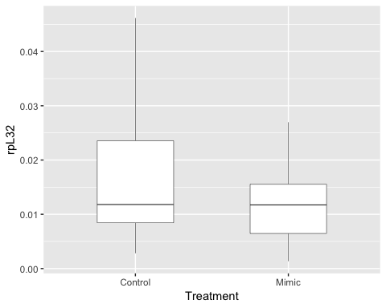
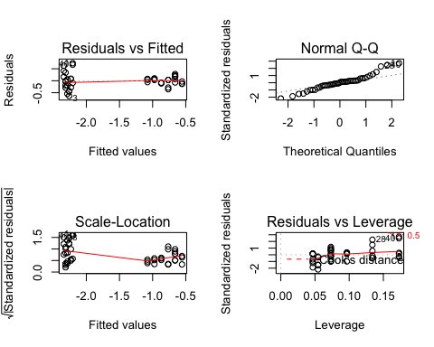
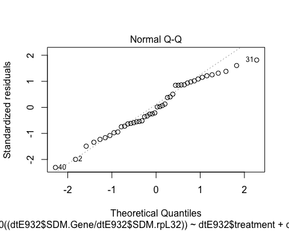

#Summary
You will find here all the analyses related to the statistics of hormonal treatments carried out in Vea et al. (submitted to Journal of Insect Biochemistry and Molecular Biology). 


```r
library(ggplot2)
library(plyr)
library(tidyr)
```


#Effect of pyriproxyfen treatment
##Data

```r
#loading file JHM treatment
#females
dtf<-read.csv(file="E93-Pyr-N3D0.csv",header = TRUE)
names(dtf)
```

```
##  [1] "cDNA."          "Compound"       "Treatment"      "TreatmentStage"
##  [5] "Sex"            "DAT"            "DayL"           "N"             
##  [9] "rpL32"          "Kr.h1"          "E93"            "PkE93.1"       
## [13] "PkE93.2"        "PkE93.3"
```

```r
head(dtf)
```

```
##   cDNA. Compound Treatment TreatmentStage    Sex DAT DayL N   rpL32
## 1   203 Methanol   Control           N3D0 female   1    A 1 0.00281
## 2   204 Methanol   Control           N3D0 female   1    A 1 0.00405
## 3   205 Methanol   Control           N3D0 female   1    A 1 0.01160
## 4   206 Methanol   Control           N3D0 female   1    A 1 0.00519
## 5   281 Methanol   Control           N3D0 female   2    B 1 0.01247
## 6   282 Methanol   Control           N3D0 female   2    B 1 0.00844
##       Kr.h1       E93   PkE93.1   PkE93.2   PkE93.3
## 1 4.220e-05 9.750e-06 1.765e-06 3.333e-07 6.944e-08
## 2 6.700e-05 1.810e-05 1.847e-06 3.363e-07 9.378e-08
## 3 9.580e-05 3.810e-05 5.162e-06 1.081e-06 1.435e-07
## 4 7.690e-05 2.780e-05 3.619e-06 5.923e-07 1.668e-07
## 5 4.730e-05 2.261e-05 1.528e-06 4.653e-07 1.791e-07
## 6 3.376e-05 1.156e-05 2.448e-07 1.614e-07 1.413e-07
```

```r
dtf<-gather(dtf,Gene,SDM,10:14)
#dtf
head(dtf)
```

```
##   cDNA. Compound Treatment TreatmentStage    Sex DAT DayL N   rpL32  Gene
## 1   203 Methanol   Control           N3D0 female   1    A 1 0.00281 Kr.h1
## 2   204 Methanol   Control           N3D0 female   1    A 1 0.00405 Kr.h1
## 3   205 Methanol   Control           N3D0 female   1    A 1 0.01160 Kr.h1
## 4   206 Methanol   Control           N3D0 female   1    A 1 0.00519 Kr.h1
## 5   281 Methanol   Control           N3D0 female   2    B 1 0.01247 Kr.h1
## 6   282 Methanol   Control           N3D0 female   2    B 1 0.00844 Kr.h1
##         SDM
## 1 4.220e-05
## 2 6.700e-05
## 3 9.580e-05
## 4 7.690e-05
## 5 4.730e-05
## 6 3.376e-05
```

```r
#males
dtm<-read.csv(file="E93-Pyr-male.csv",header = TRUE)
names(dtm)
```

```
## [1] "Sample.ID" "treatment" "Day"       "DayL"      "Gene"      "SDM.Gene" 
## [7] "SDM.rpL32"
```

```r
head(dtm)
```

```
##   Sample.ID treatment Day DayL  Gene SDM.Gene SDM.rpL32
## 1       299   Control   1    A Kr-h1 3.91e-05   0.00116
## 2       300   Control   2    B Kr-h1 1.05e-05   0.00148
## 3       301   Control   3    C Kr-h1 2.82e-06   0.00221
## 4       302   Control   4    D Kr-h1 3.03e-06   0.00206
## 5       303   Control   4    D Kr-h1 7.78e-06   0.00238
## 6       304     Mimic   4    D Kr-h1 1.50e-04   0.00197
```

##Checking for data distribution 

```r
#female dataset subsetting to keep Kr-h1 and E93 1 and 2 subset from D4 to D8
dtf<-subset(dtf, Gene=="Kr.h1" | Gene=="PkE93.1"| Gene=="PkE93.2"| Gene=="PkE93.3")
dtf$Gene
```

```
##   [1] "Kr.h1"   "Kr.h1"   "Kr.h1"   "Kr.h1"   "Kr.h1"   "Kr.h1"   "Kr.h1"  
##   [8] "Kr.h1"   "Kr.h1"   "Kr.h1"   "Kr.h1"   "Kr.h1"   "Kr.h1"   "Kr.h1"  
##  [15] "Kr.h1"   "Kr.h1"   "Kr.h1"   "Kr.h1"   "Kr.h1"   "Kr.h1"   "Kr.h1"  
##  [22] "Kr.h1"   "Kr.h1"   "Kr.h1"   "Kr.h1"   "Kr.h1"   "Kr.h1"   "Kr.h1"  
##  [29] "Kr.h1"   "Kr.h1"   "Kr.h1"   "Kr.h1"   "Kr.h1"   "Kr.h1"   "Kr.h1"  
##  [36] "Kr.h1"   "Kr.h1"   "Kr.h1"   "Kr.h1"   "Kr.h1"   "Kr.h1"   "Kr.h1"  
##  [43] "Kr.h1"   "Kr.h1"   "Kr.h1"   "Kr.h1"   "Kr.h1"   "Kr.h1"   "Kr.h1"  
##  [50] "Kr.h1"   "Kr.h1"   "Kr.h1"   "Kr.h1"   "Kr.h1"   "Kr.h1"   "Kr.h1"  
##  [57] "Kr.h1"   "Kr.h1"   "Kr.h1"   "PkE93.1" "PkE93.1" "PkE93.1" "PkE93.1"
##  [64] "PkE93.1" "PkE93.1" "PkE93.1" "PkE93.1" "PkE93.1" "PkE93.1" "PkE93.1"
##  [71] "PkE93.1" "PkE93.1" "PkE93.1" "PkE93.1" "PkE93.1" "PkE93.1" "PkE93.1"
##  [78] "PkE93.1" "PkE93.1" "PkE93.1" "PkE93.1" "PkE93.1" "PkE93.1" "PkE93.1"
##  [85] "PkE93.1" "PkE93.1" "PkE93.1" "PkE93.1" "PkE93.1" "PkE93.1" "PkE93.1"
##  [92] "PkE93.1" "PkE93.1" "PkE93.1" "PkE93.1" "PkE93.1" "PkE93.1" "PkE93.1"
##  [99] "PkE93.1" "PkE93.1" "PkE93.1" "PkE93.1" "PkE93.1" "PkE93.1" "PkE93.1"
## [106] "PkE93.1" "PkE93.1" "PkE93.1" "PkE93.1" "PkE93.1" "PkE93.1" "PkE93.1"
## [113] "PkE93.1" "PkE93.1" "PkE93.1" "PkE93.1" "PkE93.1" "PkE93.1" "PkE93.2"
## [120] "PkE93.2" "PkE93.2" "PkE93.2" "PkE93.2" "PkE93.2" "PkE93.2" "PkE93.2"
## [127] "PkE93.2" "PkE93.2" "PkE93.2" "PkE93.2" "PkE93.2" "PkE93.2" "PkE93.2"
## [134] "PkE93.2" "PkE93.2" "PkE93.2" "PkE93.2" "PkE93.2" "PkE93.2" "PkE93.2"
## [141] "PkE93.2" "PkE93.2" "PkE93.2" "PkE93.2" "PkE93.2" "PkE93.2" "PkE93.2"
## [148] "PkE93.2" "PkE93.2" "PkE93.2" "PkE93.2" "PkE93.2" "PkE93.2" "PkE93.2"
## [155] "PkE93.2" "PkE93.2" "PkE93.2" "PkE93.2" "PkE93.2" "PkE93.2" "PkE93.2"
## [162] "PkE93.2" "PkE93.2" "PkE93.2" "PkE93.2" "PkE93.2" "PkE93.2" "PkE93.2"
## [169] "PkE93.2" "PkE93.2" "PkE93.2" "PkE93.2" "PkE93.2" "PkE93.2" "PkE93.2"
## [176] "PkE93.2" "PkE93.2" "PkE93.3" "PkE93.3" "PkE93.3" "PkE93.3" "PkE93.3"
## [183] "PkE93.3" "PkE93.3" "PkE93.3" "PkE93.3" "PkE93.3" "PkE93.3" "PkE93.3"
## [190] "PkE93.3" "PkE93.3" "PkE93.3" "PkE93.3" "PkE93.3" "PkE93.3" "PkE93.3"
## [197] "PkE93.3" "PkE93.3" "PkE93.3" "PkE93.3" "PkE93.3" "PkE93.3" "PkE93.3"
## [204] "PkE93.3" "PkE93.3" "PkE93.3" "PkE93.3" "PkE93.3" "PkE93.3" "PkE93.3"
## [211] "PkE93.3" "PkE93.3" "PkE93.3" "PkE93.3" "PkE93.3" "PkE93.3" "PkE93.3"
## [218] "PkE93.3" "PkE93.3" "PkE93.3" "PkE93.3" "PkE93.3" "PkE93.3" "PkE93.3"
## [225] "PkE93.3" "PkE93.3" "PkE93.3" "PkE93.3" "PkE93.3" "PkE93.3" "PkE93.3"
## [232] "PkE93.3" "PkE93.3" "PkE93.3" "PkE93.3" "PkE93.3"
```

```r
dtf$DAT
```

```
##   [1] 1 1 1 1 2 2 2 3 3 3 4 4 4 5 5 5 6 6 6 7 7 7 8 8 8 8 8 8 8 1 1 1 1 2 2
##  [36] 2 3 3 3 4 4 4 5 5 5 6 6 6 7 7 7 8 8 8 8 8 8 8 8 1 1 1 1 2 2 2 3 3 3 4
##  [71] 4 4 5 5 5 6 6 6 7 7 7 8 8 8 8 8 8 8 1 1 1 1 2 2 2 3 3 3 4 4 4 5 5 5 6
## [106] 6 6 7 7 7 8 8 8 8 8 8 8 8 1 1 1 1 2 2 2 3 3 3 4 4 4 5 5 5 6 6 6 7 7 7
## [141] 8 8 8 8 8 8 8 1 1 1 1 2 2 2 3 3 3 4 4 4 5 5 5 6 6 6 7 7 7 8 8 8 8 8 8
## [176] 8 8 1 1 1 1 2 2 2 3 3 3 4 4 4 5 5 5 6 6 6 7 7 7 8 8 8 8 8 8 8 1 1 1 1
## [211] 2 2 2 3 3 3 4 4 4 5 5 5 6 6 6 7 7 7 8 8 8 8 8 8 8 8
```

###Comparing the absolute amount of reference gene between treatments

```r
dtfbox_RPL32 <- ggplot(dtf,aes(x=Treatment,y=rpL32)) + geom_boxplot(width=0.5, size=0.2, outlier.size = 0.1)

dtfbox_RPL32
```

<!-- -->

```r
hist(dtf$rpL32)
```

<!-- -->

```r
hist(log10(dtf$rpL32))
```

<!-- -->

```r
#test normality
shapiro.test(dtf$rpL32) ## not normal distribution
```

```
## 
## 	Shapiro-Wilk normality test
## 
## data:  dtf$rpL32
## W = 0.90843, p-value = 7.701e-11
```

```r
#non parametric test, Mann Whitney U test
wilcox.test(data=dtf, dtf$rpL32~dtf$Treatment, paired=FALSE) ## difference not significant
```

```
## 
## 	Wilcoxon rank sum test with continuity correction
## 
## data:  dtf$rpL32 by dtf$Treatment
## W = 8056, p-value = 0.03665
## alternative hypothesis: true location shift is not equal to 0
```


###Female dataset for PkKr-h1

```r
#all female dataset Kr-h1
dtfkrh1<-subset(dtf, Gene=="Kr.h1")
dtfkrh1$Gene
```

```
##  [1] "Kr.h1" "Kr.h1" "Kr.h1" "Kr.h1" "Kr.h1" "Kr.h1" "Kr.h1" "Kr.h1"
##  [9] "Kr.h1" "Kr.h1" "Kr.h1" "Kr.h1" "Kr.h1" "Kr.h1" "Kr.h1" "Kr.h1"
## [17] "Kr.h1" "Kr.h1" "Kr.h1" "Kr.h1" "Kr.h1" "Kr.h1" "Kr.h1" "Kr.h1"
## [25] "Kr.h1" "Kr.h1" "Kr.h1" "Kr.h1" "Kr.h1" "Kr.h1" "Kr.h1" "Kr.h1"
## [33] "Kr.h1" "Kr.h1" "Kr.h1" "Kr.h1" "Kr.h1" "Kr.h1" "Kr.h1" "Kr.h1"
## [41] "Kr.h1" "Kr.h1" "Kr.h1" "Kr.h1" "Kr.h1" "Kr.h1" "Kr.h1" "Kr.h1"
## [49] "Kr.h1" "Kr.h1" "Kr.h1" "Kr.h1" "Kr.h1" "Kr.h1" "Kr.h1" "Kr.h1"
## [57] "Kr.h1" "Kr.h1" "Kr.h1"
```

```r
hist(dtfkrh1$SDM/dtfkrh1$rpL32, main="Distribution of all data  PkKr-h1/rpL32, regardless of treatment type")#not normal
```

<!-- -->

The distribution of qPCR data collected for relative expression of PkKr-h1 is not normal. We decided to transform the data to log10.


```r
  #log transformed
hist(log10(dtfkrh1$SDM/dtfkrh1$rpL32)) #more or less normal
```

<!-- -->

We also checked data distribution by treatment


```r
#by treatment
dtfkrh1CT<-subset(dtfkrh1,Treatment=="Control")
dtfkrh1CT$Treatment
```

```
##  [1] Control Control Control Control Control Control Control Control
##  [9] Control Control Control Control Control Control Control Control
## [17] Control Control Control Control Control Control Control Control
## [25] Control Control Control Control Control
## Levels: Control Mimic
```

```r
dtfkrh1JHM<-subset(dtfkrh1,Treatment=="Mimic")
dtfkrh1JHM$Treatment
```

```
##  [1] Mimic Mimic Mimic Mimic Mimic Mimic Mimic Mimic Mimic Mimic Mimic
## [12] Mimic Mimic Mimic Mimic Mimic Mimic Mimic Mimic Mimic Mimic Mimic
## [23] Mimic Mimic Mimic Mimic Mimic Mimic Mimic Mimic
## Levels: Control Mimic
```

```r
hist(dtfkrh1CT$SDM/dtfkrh1CT$rpL32, main="Distribution of PkKr-h1/rpL32 data, including only control treatments")
```

<!-- -->

```r
hist(dtfkrh1JHM$SDM/dtfkrh1JHM$rpL32, main="Distribution of PkKr-h1/rpL32 data, including only mimic treatments")
```

<!-- -->

```r
  #log transformed
hist(log10(dtfkrh1CT$SDM/dtfkrh1CT$rpL32)) #ok
```

<!-- -->

```r
hist(log10(dtfkrh1JHM$SDM/dtfkrh1JHM$rpL32)) #skewed normal
```

<!-- -->


```r
#all female dataset E93 1

dtfE931<-subset(dtf, Gene=="PkE93.1")
dtfE931$Gene
```

```
##  [1] "PkE93.1" "PkE93.1" "PkE93.1" "PkE93.1" "PkE93.1" "PkE93.1" "PkE93.1"
##  [8] "PkE93.1" "PkE93.1" "PkE93.1" "PkE93.1" "PkE93.1" "PkE93.1" "PkE93.1"
## [15] "PkE93.1" "PkE93.1" "PkE93.1" "PkE93.1" "PkE93.1" "PkE93.1" "PkE93.1"
## [22] "PkE93.1" "PkE93.1" "PkE93.1" "PkE93.1" "PkE93.1" "PkE93.1" "PkE93.1"
## [29] "PkE93.1" "PkE93.1" "PkE93.1" "PkE93.1" "PkE93.1" "PkE93.1" "PkE93.1"
## [36] "PkE93.1" "PkE93.1" "PkE93.1" "PkE93.1" "PkE93.1" "PkE93.1" "PkE93.1"
## [43] "PkE93.1" "PkE93.1" "PkE93.1" "PkE93.1" "PkE93.1" "PkE93.1" "PkE93.1"
## [50] "PkE93.1" "PkE93.1" "PkE93.1" "PkE93.1" "PkE93.1" "PkE93.1" "PkE93.1"
## [57] "PkE93.1" "PkE93.1" "PkE93.1"
```

```r
hist(dtfE931$SDM/dtfE931$rpL32) #distribution not normal
```

<!-- -->

```r
  #log transformed
hist(log10(dtfE931$SDM/dtfE931$rpL32))
```

<!-- -->


```r
#by treatment
dtfE931CT<-subset(dtfE931,Treatment=="Control")
dtfE931CT$Treatment
```

```
##  [1] Control Control Control Control Control Control Control Control
##  [9] Control Control Control Control Control Control Control Control
## [17] Control Control Control Control Control Control Control Control
## [25] Control Control Control Control Control
## Levels: Control Mimic
```

```r
dtfE931JHM<-subset(dtfE931,Treatment=="Mimic")
dtfE931JHM$Treatment
```

```
##  [1] Mimic Mimic Mimic Mimic Mimic Mimic Mimic Mimic Mimic Mimic Mimic
## [12] Mimic Mimic Mimic Mimic Mimic Mimic Mimic Mimic Mimic Mimic Mimic
## [23] Mimic Mimic Mimic Mimic Mimic Mimic Mimic Mimic
## Levels: Control Mimic
```

```r
hist(dtfE931CT$SDM/dtfE931CT$rpL32) #not normal
```

<!-- -->

```r
hist(dtfE931JHM$SDM/dtfE931JHM$rpL32)
```

<!-- -->

```r
  #log transformed
hist(log10(dtfE931CT$SDM/dtfE931CT$rpL32)) #two peaks
```

<!-- -->

```r
hist(log10(dtfE931JHM$SDM/dtfE931JHM$rpL32)) #weird!
```

<!-- -->


```r
#all female dataset E93 1
dtfE932<-subset(dtf, Gene=="PkE93.2")
dtfE932$Gene
```

```
##  [1] "PkE93.2" "PkE93.2" "PkE93.2" "PkE93.2" "PkE93.2" "PkE93.2" "PkE93.2"
##  [8] "PkE93.2" "PkE93.2" "PkE93.2" "PkE93.2" "PkE93.2" "PkE93.2" "PkE93.2"
## [15] "PkE93.2" "PkE93.2" "PkE93.2" "PkE93.2" "PkE93.2" "PkE93.2" "PkE93.2"
## [22] "PkE93.2" "PkE93.2" "PkE93.2" "PkE93.2" "PkE93.2" "PkE93.2" "PkE93.2"
## [29] "PkE93.2" "PkE93.2" "PkE93.2" "PkE93.2" "PkE93.2" "PkE93.2" "PkE93.2"
## [36] "PkE93.2" "PkE93.2" "PkE93.2" "PkE93.2" "PkE93.2" "PkE93.2" "PkE93.2"
## [43] "PkE93.2" "PkE93.2" "PkE93.2" "PkE93.2" "PkE93.2" "PkE93.2" "PkE93.2"
## [50] "PkE93.2" "PkE93.2" "PkE93.2" "PkE93.2" "PkE93.2" "PkE93.2" "PkE93.2"
## [57] "PkE93.2" "PkE93.2" "PkE93.2"
```

```r
hist(dtfE932$SDM/dtfE932$rpL32) #distribution not normal
```

<!-- -->

```r
  #log transformed
hist(log10(dtfE932$SDM/dtfE932$rpL32) )
```

<!-- -->


```r
#by treatment
dtfE932CT<-subset(dtfE931,Treatment=="Control")
dtfE932CT$Treatment
```

```
##  [1] Control Control Control Control Control Control Control Control
##  [9] Control Control Control Control Control Control Control Control
## [17] Control Control Control Control Control Control Control Control
## [25] Control Control Control Control Control
## Levels: Control Mimic
```

```r
dtfE932JHM<-subset(dtfE931,Treatment=="Mimic")
dtfE931JHM$Treatment
```

```
##  [1] Mimic Mimic Mimic Mimic Mimic Mimic Mimic Mimic Mimic Mimic Mimic
## [12] Mimic Mimic Mimic Mimic Mimic Mimic Mimic Mimic Mimic Mimic Mimic
## [23] Mimic Mimic Mimic Mimic Mimic Mimic Mimic Mimic
## Levels: Control Mimic
```

```r
hist(dtfE931CT$SDM/dtfE931CT$rpL32) #not normal
```

<!-- -->

```r
hist(dtfE931JHM$SDM/dtfE931JHM$rpL32)
```

<!-- -->

```r
  #log transformed
hist(log10(dtfE931CT$SDM/dtfE931CT$rpL32)) #two peaks
```

<!-- -->

```r
hist(log10(dtfE931JHM$SDM/dtfE931JHM$rpL32)) #weird!
```

<!-- -->


```r
#male dataset subset Krh1 and E93 1
head(dtm)
```

```
##   Sample.ID treatment Day DayL  Gene SDM.Gene SDM.rpL32
## 1       299   Control   1    A Kr-h1 3.91e-05   0.00116
## 2       300   Control   2    B Kr-h1 1.05e-05   0.00148
## 3       301   Control   3    C Kr-h1 2.82e-06   0.00221
## 4       302   Control   4    D Kr-h1 3.03e-06   0.00206
## 5       303   Control   4    D Kr-h1 7.78e-06   0.00238
## 6       304     Mimic   4    D Kr-h1 1.50e-04   0.00197
```

```r
#subsetting Kr-h1 and E93 1
dtm<-subset(dtm, Gene=="Kr-h1" | Gene=="PkE93-1"| Gene=="PkE93-2"| Gene=="PkE93-3")
dtm$Gene
```

```
##   [1] Kr-h1   Kr-h1   Kr-h1   Kr-h1   Kr-h1   Kr-h1   Kr-h1   Kr-h1  
##   [9] Kr-h1   Kr-h1   Kr-h1   Kr-h1   Kr-h1   Kr-h1   Kr-h1   Kr-h1  
##  [17] Kr-h1   Kr-h1   Kr-h1   Kr-h1   Kr-h1   Kr-h1   Kr-h1   Kr-h1  
##  [25] Kr-h1   Kr-h1   Kr-h1   Kr-h1   Kr-h1   Kr-h1   Kr-h1   Kr-h1  
##  [33] Kr-h1   Kr-h1   Kr-h1   Kr-h1   Kr-h1   Kr-h1   Kr-h1   Kr-h1  
##  [41] Kr-h1   Kr-h1   Kr-h1   Kr-h1   PkE93-1 PkE93-1 PkE93-1 PkE93-1
##  [49] PkE93-1 PkE93-1 PkE93-1 PkE93-1 PkE93-1 PkE93-1 PkE93-1 PkE93-1
##  [57] PkE93-1 PkE93-1 PkE93-1 PkE93-1 PkE93-1 PkE93-1 PkE93-1 PkE93-1
##  [65] PkE93-1 PkE93-1 PkE93-1 PkE93-1 PkE93-1 PkE93-1 PkE93-1 PkE93-1
##  [73] PkE93-1 PkE93-1 PkE93-1 PkE93-1 PkE93-1 PkE93-1 PkE93-1 PkE93-1
##  [81] PkE93-1 PkE93-1 PkE93-1 PkE93-1 PkE93-1 PkE93-1 PkE93-1 PkE93-1
##  [89] PkE93-2 PkE93-2 PkE93-2 PkE93-2 PkE93-2 PkE93-2 PkE93-2 PkE93-2
##  [97] PkE93-2 PkE93-2 PkE93-2 PkE93-2 PkE93-2 PkE93-2 PkE93-2 PkE93-2
## [105] PkE93-2 PkE93-2 PkE93-2 PkE93-2 PkE93-2 PkE93-2 PkE93-2 PkE93-2
## [113] PkE93-2 PkE93-2 PkE93-2 PkE93-2 PkE93-2 PkE93-2 PkE93-2 PkE93-2
## [121] PkE93-2 PkE93-2 PkE93-2 PkE93-2 PkE93-2 PkE93-2 PkE93-2 PkE93-2
## [129] PkE93-2 PkE93-2 PkE93-2 PkE93-2 PkE93-3 PkE93-3 PkE93-3 PkE93-3
## [137] PkE93-3 PkE93-3 PkE93-3 PkE93-3 PkE93-3 PkE93-3 PkE93-3 PkE93-3
## [145] PkE93-3 PkE93-3 PkE93-3 PkE93-3 PkE93-3 PkE93-3 PkE93-3 PkE93-3
## [153] PkE93-3 PkE93-3 PkE93-3 PkE93-3 PkE93-3 PkE93-3 PkE93-3 PkE93-3
## [161] PkE93-3 PkE93-3 PkE93-3 PkE93-3 PkE93-3 PkE93-3 PkE93-3 PkE93-3
## [169] PkE93-3 PkE93-3 PkE93-3 PkE93-3 PkE93-3 PkE93-3 PkE93-3 PkE93-3
## Levels: Kr-h1 PkE93-1 PkE93-2 PkE93-3
```

```r
dtm$Day
```

```
##   [1] 1 2 3 4 4 4 4 6 5 5 5 5 5 5 5 5 5 5 5 5 4 4 6 6 6 4 4 6 6 2 2 2 2 2 3
##  [36] 3 3 3 3 1 1 1 1 1 1 2 3 4 4 4 4 6 5 5 5 5 5 5 5 5 5 5 5 5 4 4 6 6 6 4
##  [71] 4 6 6 2 2 2 2 2 3 3 3 3 3 1 1 1 1 1 1 2 3 4 4 4 4 6 5 5 5 5 5 5 5 5 5
## [106] 5 5 5 4 4 6 6 6 4 4 6 6 2 2 2 2 2 3 3 3 3 3 1 1 1 1 1 1 2 3 4 4 4 4 6
## [141] 5 5 5 5 5 5 5 5 5 5 5 5 4 4 6 6 6 4 4 6 6 2 2 2 2 2 3 3 3 3 3 1 1 1 1
## [176] 1
```

```r
#all male krh1
dtmkrh1<-subset(dtm, Gene=="Kr-h1")
dtmkrh1$Gene
```

```
##  [1] Kr-h1 Kr-h1 Kr-h1 Kr-h1 Kr-h1 Kr-h1 Kr-h1 Kr-h1 Kr-h1 Kr-h1 Kr-h1
## [12] Kr-h1 Kr-h1 Kr-h1 Kr-h1 Kr-h1 Kr-h1 Kr-h1 Kr-h1 Kr-h1 Kr-h1 Kr-h1
## [23] Kr-h1 Kr-h1 Kr-h1 Kr-h1 Kr-h1 Kr-h1 Kr-h1 Kr-h1 Kr-h1 Kr-h1 Kr-h1
## [34] Kr-h1 Kr-h1 Kr-h1 Kr-h1 Kr-h1 Kr-h1 Kr-h1 Kr-h1 Kr-h1 Kr-h1 Kr-h1
## Levels: Kr-h1 PkE93-1 PkE93-2 PkE93-3
```

```r
names(dtmkrh1)
```

```
## [1] "Sample.ID" "treatment" "Day"       "DayL"      "Gene"      "SDM.Gene" 
## [7] "SDM.rpL32"
```

```r
hist(dtmkrh1$SDM.Gene/dtmkrh1$SDM.rpL32) #not normally distributed
```

<!-- -->

```r
  #log transformed
hist(log10(dtmkrh1$SDM.Gene/dtmkrh1$SDM.rpL32)) #not normally distributed
```

<!-- -->

```r
#male Krh1 by treatment
#by treatment
dtmkrh1CT<-subset(dtmkrh1,treatment=="Control")
dtmkrh1CT$treatment
```

```
##  [1] Control Control Control Control Control Control Control Control
##  [9] Control Control Control Control Control Control Control Control
## [17] Control Control Control Control Control Control
## Levels: Control Mimic
```

```r
dtmkrh1JHM<-subset(dtmkrh1,treatment=="Mimic")
dtmkrh1JHM$treatment
```

```
##  [1] Mimic Mimic Mimic Mimic Mimic Mimic Mimic Mimic Mimic Mimic Mimic
## [12] Mimic Mimic Mimic Mimic Mimic Mimic Mimic Mimic Mimic Mimic Mimic
## Levels: Control Mimic
```

```r
names(dtmkrh1CT)
```

```
## [1] "Sample.ID" "treatment" "Day"       "DayL"      "Gene"      "SDM.Gene" 
## [7] "SDM.rpL32"
```

```r
hist(dtmkrh1CT$SDM.Gene/dtmkrh1CT$SDM.rpL32)
```

<!-- -->

```r
hist(dtmkrh1JHM$SDM.Gene/dtmkrh1JHM$SDM.rpL32)
```

<!-- -->

```r
  #log transformed
hist(log(dtmkrh1CT$SDM.Gene/dtmkrh1CT$SDM.rpL32)) #ok
```

<!-- -->

```r
hist(log(dtmkrh1JHM$SDM.Gene/dtmkrh1JHM$SDM.rpL32)) #ok
```

<!-- -->
We decided to use a log10 transformation of our absolute values normalized by the reference gene because the histograms did not show a normal distribution.


#statistical tests: general effect of JHM
## male on Kr-h1 expression by treatment and by day 

```r
par(mfrow=c(2,2))
#dtm
dtkrh1<-subset(dtm,Gene=="Kr-h1") #subsetting the dataset to have only Kr-h1
dtkrh1$Gene
```

```
##  [1] Kr-h1 Kr-h1 Kr-h1 Kr-h1 Kr-h1 Kr-h1 Kr-h1 Kr-h1 Kr-h1 Kr-h1 Kr-h1
## [12] Kr-h1 Kr-h1 Kr-h1 Kr-h1 Kr-h1 Kr-h1 Kr-h1 Kr-h1 Kr-h1 Kr-h1 Kr-h1
## [23] Kr-h1 Kr-h1 Kr-h1 Kr-h1 Kr-h1 Kr-h1 Kr-h1 Kr-h1 Kr-h1 Kr-h1 Kr-h1
## [34] Kr-h1 Kr-h1 Kr-h1 Kr-h1 Kr-h1 Kr-h1 Kr-h1 Kr-h1 Kr-h1 Kr-h1 Kr-h1
## Levels: Kr-h1 PkE93-1 PkE93-2 PkE93-3
```

```r
names(dtkrh1)
```

```
## [1] "Sample.ID" "treatment" "Day"       "DayL"      "Gene"      "SDM.Gene" 
## [7] "SDM.rpL32"
```

```r
is.numeric(dtkrh1$Day)
```

```
## [1] TRUE
```

```r
dtkrh1$treatment
```

```
##  [1] Control Control Control Control Control Mimic   Mimic   Control
##  [9] Control Control Control Control Control Control Mimic   Mimic  
## [17] Mimic   Mimic   Mimic   Mimic   Control Control Mimic   Mimic  
## [25] Mimic   Mimic   Mimic   Control Control Control Control Mimic  
## [33] Mimic   Mimic   Control Control Mimic   Mimic   Mimic   Control
## [41] Control Mimic   Mimic   Mimic  
## Levels: Control Mimic
```

```r
names(dtkrh1)
```

```
## [1] "Sample.ID" "treatment" "Day"       "DayL"      "Gene"      "SDM.Gene" 
## [7] "SDM.rpL32"
```

```r
#fitting linear model on transformed data
malelmkrh1<-lm(log10((dtkrh1$SDM.Gene/dtkrh1$SDM.rpL32))~dtkrh1$treatment+dtkrh1$Day+dtkrh1$treatment:dtkrh1$Day)
summary.lm(malelmkrh1) # there is an interaction between time and treatment
```

```
## 
## Call:
## lm(formula = log10((dtkrh1$SDM.Gene/dtkrh1$SDM.rpL32)) ~ dtkrh1$treatment + 
##     dtkrh1$Day + dtkrh1$treatment:dtkrh1$Day)
## 
## Residuals:
##      Min       1Q   Median       3Q      Max 
## -0.63424 -0.11723  0.00956  0.08791  0.73408 
## 
## Coefficients:
##                                  Estimate Std. Error t value Pr(>|t|)    
## (Intercept)                      -2.17959    0.15857 -13.746  < 2e-16 ***
## dtkrh1$treatmentMimic             0.99819    0.22425   4.451 6.67e-05 ***
## dtkrh1$Day                       -0.02677    0.03898  -0.687   0.4962    
## dtkrh1$treatmentMimic:dtkrh1$Day  0.13097    0.05513   2.376   0.0224 *  
## ---
## Signif. codes:  0 '***' 0.001 '**' 0.01 '*' 0.05 '.' 0.1 ' ' 1
## 
## Residual standard error: 0.2978 on 40 degrees of freedom
## Multiple R-squared:  0.8756,	Adjusted R-squared:  0.8663 
## F-statistic: 93.87 on 3 and 40 DF,  p-value: < 2.2e-16
```

```r
plot(malelmkrh1)
```

<!-- -->

The treatment has a significant effect on PkKr-h1 expression (p-value 6.67e-5), gene expression doesn't seem to change significantly over time after treatment (0.4962), but an interaction between type of treatment and day after treatment was observed (0.0224). 
I therefore kept the interaction of variables in the model.


## male on E93-1 expression by treatment and by day

```r
par(mfrow=c(2,2))
dtE931<-subset(dtm,Gene=="PkE93-1")
dtE931$Gene
```

```
##  [1] PkE93-1 PkE93-1 PkE93-1 PkE93-1 PkE93-1 PkE93-1 PkE93-1 PkE93-1
##  [9] PkE93-1 PkE93-1 PkE93-1 PkE93-1 PkE93-1 PkE93-1 PkE93-1 PkE93-1
## [17] PkE93-1 PkE93-1 PkE93-1 PkE93-1 PkE93-1 PkE93-1 PkE93-1 PkE93-1
## [25] PkE93-1 PkE93-1 PkE93-1 PkE93-1 PkE93-1 PkE93-1 PkE93-1 PkE93-1
## [33] PkE93-1 PkE93-1 PkE93-1 PkE93-1 PkE93-1 PkE93-1 PkE93-1 PkE93-1
## [41] PkE93-1 PkE93-1 PkE93-1 PkE93-1
## Levels: Kr-h1 PkE93-1 PkE93-2 PkE93-3
```

```r
dtE931$Day
```

```
##  [1] 1 2 3 4 4 4 4 6 5 5 5 5 5 5 5 5 5 5 5 5 4 4 6 6 6 4 4 6 6 2 2 2 2 2 3
## [36] 3 3 3 3 1 1 1 1 1
```

```r
is.numeric(dtE931$Day)
```

```
## [1] TRUE
```

```r
names(dtE931)
```

```
## [1] "Sample.ID" "treatment" "Day"       "DayL"      "Gene"      "SDM.Gene" 
## [7] "SDM.rpL32"
```

```r
#transformed lm
malelmE931<-lm(log10((dtE931$SDM.Gene/dtE931$SDM.rpL32))~dtE931$treatment+dtE931$Day+dtE931$treatment:dtE931$Day)
summary.lm(malelmE931)  # no significant interaction
```

```
## 
## Call:
## lm(formula = log10((dtE931$SDM.Gene/dtE931$SDM.rpL32)) ~ dtE931$treatment + 
##     dtE931$Day + dtE931$treatment:dtE931$Day)
## 
## Residuals:
##      Min       1Q   Median       3Q      Max 
## -0.38530 -0.12448 -0.02058  0.15167  0.46154 
## 
## Coefficients:
##                                  Estimate Std. Error t value Pr(>|t|)    
## (Intercept)                      -0.88820    0.10564  -8.408 2.23e-10 ***
## dtE931$treatmentMimic            -0.28274    0.14939  -1.893   0.0657 .  
## dtE931$Day                        0.16079    0.02597   6.192 2.54e-07 ***
## dtE931$treatmentMimic:dtE931$Day -0.04946    0.03673  -1.347   0.1857    
## ---
## Signif. codes:  0 '***' 0.001 '**' 0.01 '*' 0.05 '.' 0.1 ' ' 1
## 
## Residual standard error: 0.1984 on 40 degrees of freedom
## Multiple R-squared:  0.7463,	Adjusted R-squared:  0.7273 
## F-statistic: 39.23 on 3 and 40 DF,  p-value: 5.453e-12
```
If we consider the linear model including an interaction between variables, the JHM treatment does not have a significant effect, but there is a change over time in gene expression. Because the interaction between these two variables are not significant, I removed it from the model considering only the two variables separately.


```r
#remove interaction
malelmE9312<-lm(log10((dtE931$SDM.Gene/dtE931$SDM.rpL32))~dtE931$treatment+dtE931$Day)
summary.lm(malelmE9312)
```

```
## 
## Call:
## lm(formula = log10((dtE931$SDM.Gene/dtE931$SDM.rpL32)) ~ dtE931$treatment + 
##     dtE931$Day)
## 
## Residuals:
##      Min       1Q   Median       3Q      Max 
## -0.45274 -0.13596 -0.00738  0.17144  0.43007 
## 
## Coefficients:
##                       Estimate Std. Error t value Pr(>|t|)    
## (Intercept)           -0.79603    0.08126  -9.797 2.67e-12 ***
## dtE931$treatmentMimic -0.46707    0.06041  -7.732 1.56e-09 ***
## dtE931$Day             0.13607    0.01854   7.337 5.53e-09 ***
## ---
## Signif. codes:  0 '***' 0.001 '**' 0.01 '*' 0.05 '.' 0.1 ' ' 1
## 
## Residual standard error: 0.2004 on 41 degrees of freedom
## Multiple R-squared:  0.7348,	Adjusted R-squared:  0.7219 
## F-statistic: 56.81 on 2 and 41 DF,  p-value: 1.523e-12
```

```r
plot(malelmE931)
```

<!-- --><!-- --><!-- --><!-- -->
After removing the interaction, the JHM treatment has asignificant effect on gene expression and the expression changes over time in CT and JHM.


## male on E93-2 expression by treatment and by day

```r
par(mfrow=c(2,2))
dtE932<-subset(dtm,Gene=="PkE93-2")
dtE932$Gene
```

```
##  [1] PkE93-2 PkE93-2 PkE93-2 PkE93-2 PkE93-2 PkE93-2 PkE93-2 PkE93-2
##  [9] PkE93-2 PkE93-2 PkE93-2 PkE93-2 PkE93-2 PkE93-2 PkE93-2 PkE93-2
## [17] PkE93-2 PkE93-2 PkE93-2 PkE93-2 PkE93-2 PkE93-2 PkE93-2 PkE93-2
## [25] PkE93-2 PkE93-2 PkE93-2 PkE93-2 PkE93-2 PkE93-2 PkE93-2 PkE93-2
## [33] PkE93-2 PkE93-2 PkE93-2 PkE93-2 PkE93-2 PkE93-2 PkE93-2 PkE93-2
## [41] PkE93-2 PkE93-2 PkE93-2 PkE93-2
## Levels: Kr-h1 PkE93-1 PkE93-2 PkE93-3
```

```r
dtE932$Day
```

```
##  [1] 1 2 3 4 4 4 4 6 5 5 5 5 5 5 5 5 5 5 5 5 4 4 6 6 6 4 4 6 6 2 2 2 2 2 3
## [36] 3 3 3 3 1 1 1 1 1
```

```r
is.numeric(dtE932$Day)
```

```
## [1] TRUE
```

```r
names(dtE932)
```

```
## [1] "Sample.ID" "treatment" "Day"       "DayL"      "Gene"      "SDM.Gene" 
## [7] "SDM.rpL32"
```

```r
#transformed lm
malelmE932<-lm(log10((dtE932$SDM.Gene/dtE932$SDM.rpL32))~dtE932$treatment+dtE932$Day+dtE932$treatment:dtE932$Day)
summary.lm(malelmE932)
```

```
## 
## Call:
## lm(formula = log10((dtE932$SDM.Gene/dtE932$SDM.rpL32)) ~ dtE932$treatment + 
##     dtE932$Day + dtE932$treatment:dtE932$Day)
## 
## Residuals:
##      Min       1Q   Median       3Q      Max 
## -0.37406 -0.15091 -0.03297  0.16791  0.41903 
## 
## Coefficients:
##                                  Estimate Std. Error t value Pr(>|t|)    
## (Intercept)                      -2.36978    0.10958 -21.627  < 2e-16 ***
## dtE932$treatmentMimic            -0.41872    0.15496  -2.702 0.010062 *  
## dtE932$Day                        0.11545    0.02694   4.286 0.000111 ***
## dtE932$treatmentMimic:dtE932$Day -0.06036    0.03810  -1.584 0.120959    
## ---
## Signif. codes:  0 '***' 0.001 '**' 0.01 '*' 0.05 '.' 0.1 ' ' 1
## 
## Residual standard error: 0.2058 on 40 degrees of freedom
## Multiple R-squared:  0.7649,	Adjusted R-squared:  0.7473 
## F-statistic: 43.39 on 3 and 40 DF,  p-value: 1.201e-12
```

If we consider the linear model including an interaction between variables, the JHM treatment does not have a significant effect, but there is a change over time in gene expression. Because the interaction between these two variables are not significant, I removed it from the model considering only the two variables separately.


```r
#remove interaction
malelmE932<-lm(log10((dtE932$SDM.Gene/dtE932$SDM.rpL32))~dtE932$treatment+dtE932$Day)
summary.lm(malelmE932)
```

```
## 
## Call:
## lm(formula = log10((dtE932$SDM.Gene/dtE932$SDM.rpL32)) ~ dtE932$treatment + 
##     dtE932$Day)
## 
## Residuals:
##      Min       1Q   Median       3Q      Max 
## -0.45637 -0.13384 -0.01933  0.18042  0.36690 
## 
## Coefficients:
##                       Estimate Std. Error t value Pr(>|t|)    
## (Intercept)           -2.25729    0.08499 -26.561  < 2e-16 ***
## dtE932$treatmentMimic -0.64371    0.06318 -10.188 8.47e-13 ***
## dtE932$Day             0.08527    0.01940   4.396 7.62e-05 ***
## ---
## Signif. codes:  0 '***' 0.001 '**' 0.01 '*' 0.05 '.' 0.1 ' ' 1
## 
## Residual standard error: 0.2096 on 41 degrees of freedom
## Multiple R-squared:  0.7502,	Adjusted R-squared:  0.738 
## F-statistic: 61.56 on 2 and 41 DF,  p-value: 4.48e-13
```

```r
plot(malelmE932)
```

<!-- --><!-- --><!-- --><!-- -->
After removing the interaction, the JHM treatment has a significant effect on gene expression and the expression changes over time in CT and JHM.

## male on E93-3 expression by treatment and by day

```r
par(mfrow=c(2,2))
dtE933<-subset(dtm,Gene=="PkE93-3")
dtE933$Gene
```

```
##  [1] PkE93-3 PkE93-3 PkE93-3 PkE93-3 PkE93-3 PkE93-3 PkE93-3 PkE93-3
##  [9] PkE93-3 PkE93-3 PkE93-3 PkE93-3 PkE93-3 PkE93-3 PkE93-3 PkE93-3
## [17] PkE93-3 PkE93-3 PkE93-3 PkE93-3 PkE93-3 PkE93-3 PkE93-3 PkE93-3
## [25] PkE93-3 PkE93-3 PkE93-3 PkE93-3 PkE93-3 PkE93-3 PkE93-3 PkE93-3
## [33] PkE93-3 PkE93-3 PkE93-3 PkE93-3 PkE93-3 PkE93-3 PkE93-3 PkE93-3
## [41] PkE93-3 PkE93-3 PkE93-3 PkE93-3
## Levels: Kr-h1 PkE93-1 PkE93-2 PkE93-3
```

```r
dtE933$Day
```

```
##  [1] 1 2 3 4 4 4 4 6 5 5 5 5 5 5 5 5 5 5 5 5 4 4 6 6 6 4 4 6 6 2 2 2 2 2 3
## [36] 3 3 3 3 1 1 1 1 1
```

```r
is.numeric(dtE933$Day)
```

```
## [1] TRUE
```

```r
names(dtE933)
```

```
## [1] "Sample.ID" "treatment" "Day"       "DayL"      "Gene"      "SDM.Gene" 
## [7] "SDM.rpL32"
```

```r
#transformed lm
malelmE933<-lm(log10((dtE933$SDM.Gene/dtE933$SDM.rpL32))~dtE933$treatment+dtE933$Day+dtE933$treatment:dtE933$Day)
summary.lm(malelmE933)
```

```
## 
## Call:
## lm(formula = log10((dtE933$SDM.Gene/dtE933$SDM.rpL32)) ~ dtE933$treatment + 
##     dtE933$Day + dtE933$treatment:dtE933$Day)
## 
## Residuals:
##      Min       1Q   Median       3Q      Max 
## -0.48090 -0.09223  0.03876  0.15458  0.28137 
## 
## Coefficients:
##                                  Estimate Std. Error t value Pr(>|t|)    
## (Intercept)                      -2.84799    0.10028 -28.400   <2e-16 ***
## dtE933$treatmentMimic             0.05089    0.14182   0.359    0.722    
## dtE933$Day                       -0.03547    0.02465  -1.439    0.158    
## dtE933$treatmentMimic:dtE933$Day  0.01844    0.03487   0.529    0.600    
## ---
## Signif. codes:  0 '***' 0.001 '**' 0.01 '*' 0.05 '.' 0.1 ' ' 1
## 
## Residual standard error: 0.1883 on 40 degrees of freedom
## Multiple R-squared:  0.1487,	Adjusted R-squared:  0.08483 
## F-statistic: 2.329 on 3 and 40 DF,  p-value: 0.08898
```
If we consider the linear model including an interaction between variables, the JHM treatment does not have a significant effect, but there is a change over time in gene expression. Because the interaction between these two variables are not significant, I removed it from the model considering only the two variables separately.


```r
#remove interaction
malelmE933<-lm(log10((dtE933$SDM.Gene/dtE933$SDM.rpL32))~dtE933$treatment+dtE933$Day)
summary.lm(malelmE933)
```

```
## 
## Call:
## lm(formula = log10((dtE933$SDM.Gene/dtE933$SDM.rpL32)) ~ dtE933$treatment + 
##     dtE933$Day)
## 
## Residuals:
##      Min       1Q   Median       3Q      Max 
## -0.48342 -0.08483  0.03620  0.14774  0.26041 
## 
## Coefficients:
##                       Estimate Std. Error t value Pr(>|t|)    
## (Intercept)           -2.88236    0.07571 -38.071   <2e-16 ***
## dtE933$treatmentMimic  0.11964    0.05629   2.126   0.0396 *  
## dtE933$Day            -0.02625    0.01728  -1.519   0.1364    
## ---
## Signif. codes:  0 '***' 0.001 '**' 0.01 '*' 0.05 '.' 0.1 ' ' 1
## 
## Residual standard error: 0.1867 on 41 degrees of freedom
## Multiple R-squared:  0.1427,	Adjusted R-squared:  0.1009 
## F-statistic: 3.413 on 2 and 41 DF,  p-value: 0.04256
```

```r
plot(malelmE933)
```

<!-- --><!-- --><!-- --><!-- -->
After removing the interaction between variables, there is a significant effect of the treatment on E93 isoform 3 in males.

## Female on Kr-h1 expression by treatment and by day

```r
par(mfrow=c(2,2))
dtfkrh1<-subset(dtf,Gene=="Kr.h1")
dtfkrh1$Gene
```

```
##  [1] "Kr.h1" "Kr.h1" "Kr.h1" "Kr.h1" "Kr.h1" "Kr.h1" "Kr.h1" "Kr.h1"
##  [9] "Kr.h1" "Kr.h1" "Kr.h1" "Kr.h1" "Kr.h1" "Kr.h1" "Kr.h1" "Kr.h1"
## [17] "Kr.h1" "Kr.h1" "Kr.h1" "Kr.h1" "Kr.h1" "Kr.h1" "Kr.h1" "Kr.h1"
## [25] "Kr.h1" "Kr.h1" "Kr.h1" "Kr.h1" "Kr.h1" "Kr.h1" "Kr.h1" "Kr.h1"
## [33] "Kr.h1" "Kr.h1" "Kr.h1" "Kr.h1" "Kr.h1" "Kr.h1" "Kr.h1" "Kr.h1"
## [41] "Kr.h1" "Kr.h1" "Kr.h1" "Kr.h1" "Kr.h1" "Kr.h1" "Kr.h1" "Kr.h1"
## [49] "Kr.h1" "Kr.h1" "Kr.h1" "Kr.h1" "Kr.h1" "Kr.h1" "Kr.h1" "Kr.h1"
## [57] "Kr.h1" "Kr.h1" "Kr.h1"
```

```r
dtfkrh1$DAT
```

```
##  [1] 1 1 1 1 2 2 2 3 3 3 4 4 4 5 5 5 6 6 6 7 7 7 8 8 8 8 8 8 8 1 1 1 1 2 2
## [36] 2 3 3 3 4 4 4 5 5 5 6 6 6 7 7 7 8 8 8 8 8 8 8 8
```

```r
is.numeric(dtfkrh1$DAT)
```

```
## [1] TRUE
```

```r
names(dtfkrh1)
```

```
##  [1] "cDNA."          "Compound"       "Treatment"      "TreatmentStage"
##  [5] "Sex"            "DAT"            "DayL"           "N"             
##  [9] "rpL32"          "Gene"           "SDM"
```

```r
femalelmkrh1<-lm(log10((dtfkrh1$SDM/dtfkrh1$rpL32))~dtfkrh1$Treatment+dtfkrh1$DAT+dtfkrh1$Treatment:dtfkrh1$DAT)
summary.lm(femalelmkrh1)
```

```
## 
## Call:
## lm(formula = log10((dtfkrh1$SDM/dtfkrh1$rpL32)) ~ dtfkrh1$Treatment + 
##     dtfkrh1$DAT + dtfkrh1$Treatment:dtfkrh1$DAT)
## 
## Residuals:
##      Min       1Q   Median       3Q      Max 
## -1.01977 -0.15038  0.00834  0.16204  0.53314 
## 
## Coefficients:
##                                    Estimate Std. Error t value Pr(>|t|)
## (Intercept)                        -2.11974    0.12717 -16.669  < 2e-16
## dtfkrh1$TreatmentMimic              0.05606    0.17924   0.313  0.75564
## dtfkrh1$DAT                        -0.05306    0.02323  -2.284  0.02626
## dtfkrh1$TreatmentMimic:dtfkrh1$DAT  0.10756    0.03245   3.315  0.00163
##                                       
## (Intercept)                        ***
## dtfkrh1$TreatmentMimic                
## dtfkrh1$DAT                        *  
## dtfkrh1$TreatmentMimic:dtfkrh1$DAT ** 
## ---
## Signif. codes:  0 '***' 0.001 '**' 0.01 '*' 0.05 '.' 0.1 ' ' 1
## 
## Residual standard error: 0.3146 on 55 degrees of freedom
## Multiple R-squared:  0.5296,	Adjusted R-squared:  0.504 
## F-statistic: 20.64 on 3 and 55 DF,  p-value: 4.347e-09
```

When including the interaction between the two variables, there is a significant change in expression over time between the control and JHM groups. We therefore kept this model for PkKr-h1 in females.


## female on E93-1 expression by treatment and by day

```r
par(mfrow=c(2,2))
dtf$Gene
```

```
##   [1] "Kr.h1"   "Kr.h1"   "Kr.h1"   "Kr.h1"   "Kr.h1"   "Kr.h1"   "Kr.h1"  
##   [8] "Kr.h1"   "Kr.h1"   "Kr.h1"   "Kr.h1"   "Kr.h1"   "Kr.h1"   "Kr.h1"  
##  [15] "Kr.h1"   "Kr.h1"   "Kr.h1"   "Kr.h1"   "Kr.h1"   "Kr.h1"   "Kr.h1"  
##  [22] "Kr.h1"   "Kr.h1"   "Kr.h1"   "Kr.h1"   "Kr.h1"   "Kr.h1"   "Kr.h1"  
##  [29] "Kr.h1"   "Kr.h1"   "Kr.h1"   "Kr.h1"   "Kr.h1"   "Kr.h1"   "Kr.h1"  
##  [36] "Kr.h1"   "Kr.h1"   "Kr.h1"   "Kr.h1"   "Kr.h1"   "Kr.h1"   "Kr.h1"  
##  [43] "Kr.h1"   "Kr.h1"   "Kr.h1"   "Kr.h1"   "Kr.h1"   "Kr.h1"   "Kr.h1"  
##  [50] "Kr.h1"   "Kr.h1"   "Kr.h1"   "Kr.h1"   "Kr.h1"   "Kr.h1"   "Kr.h1"  
##  [57] "Kr.h1"   "Kr.h1"   "Kr.h1"   "PkE93.1" "PkE93.1" "PkE93.1" "PkE93.1"
##  [64] "PkE93.1" "PkE93.1" "PkE93.1" "PkE93.1" "PkE93.1" "PkE93.1" "PkE93.1"
##  [71] "PkE93.1" "PkE93.1" "PkE93.1" "PkE93.1" "PkE93.1" "PkE93.1" "PkE93.1"
##  [78] "PkE93.1" "PkE93.1" "PkE93.1" "PkE93.1" "PkE93.1" "PkE93.1" "PkE93.1"
##  [85] "PkE93.1" "PkE93.1" "PkE93.1" "PkE93.1" "PkE93.1" "PkE93.1" "PkE93.1"
##  [92] "PkE93.1" "PkE93.1" "PkE93.1" "PkE93.1" "PkE93.1" "PkE93.1" "PkE93.1"
##  [99] "PkE93.1" "PkE93.1" "PkE93.1" "PkE93.1" "PkE93.1" "PkE93.1" "PkE93.1"
## [106] "PkE93.1" "PkE93.1" "PkE93.1" "PkE93.1" "PkE93.1" "PkE93.1" "PkE93.1"
## [113] "PkE93.1" "PkE93.1" "PkE93.1" "PkE93.1" "PkE93.1" "PkE93.1" "PkE93.2"
## [120] "PkE93.2" "PkE93.2" "PkE93.2" "PkE93.2" "PkE93.2" "PkE93.2" "PkE93.2"
## [127] "PkE93.2" "PkE93.2" "PkE93.2" "PkE93.2" "PkE93.2" "PkE93.2" "PkE93.2"
## [134] "PkE93.2" "PkE93.2" "PkE93.2" "PkE93.2" "PkE93.2" "PkE93.2" "PkE93.2"
## [141] "PkE93.2" "PkE93.2" "PkE93.2" "PkE93.2" "PkE93.2" "PkE93.2" "PkE93.2"
## [148] "PkE93.2" "PkE93.2" "PkE93.2" "PkE93.2" "PkE93.2" "PkE93.2" "PkE93.2"
## [155] "PkE93.2" "PkE93.2" "PkE93.2" "PkE93.2" "PkE93.2" "PkE93.2" "PkE93.2"
## [162] "PkE93.2" "PkE93.2" "PkE93.2" "PkE93.2" "PkE93.2" "PkE93.2" "PkE93.2"
## [169] "PkE93.2" "PkE93.2" "PkE93.2" "PkE93.2" "PkE93.2" "PkE93.2" "PkE93.2"
## [176] "PkE93.2" "PkE93.2" "PkE93.3" "PkE93.3" "PkE93.3" "PkE93.3" "PkE93.3"
## [183] "PkE93.3" "PkE93.3" "PkE93.3" "PkE93.3" "PkE93.3" "PkE93.3" "PkE93.3"
## [190] "PkE93.3" "PkE93.3" "PkE93.3" "PkE93.3" "PkE93.3" "PkE93.3" "PkE93.3"
## [197] "PkE93.3" "PkE93.3" "PkE93.3" "PkE93.3" "PkE93.3" "PkE93.3" "PkE93.3"
## [204] "PkE93.3" "PkE93.3" "PkE93.3" "PkE93.3" "PkE93.3" "PkE93.3" "PkE93.3"
## [211] "PkE93.3" "PkE93.3" "PkE93.3" "PkE93.3" "PkE93.3" "PkE93.3" "PkE93.3"
## [218] "PkE93.3" "PkE93.3" "PkE93.3" "PkE93.3" "PkE93.3" "PkE93.3" "PkE93.3"
## [225] "PkE93.3" "PkE93.3" "PkE93.3" "PkE93.3" "PkE93.3" "PkE93.3" "PkE93.3"
## [232] "PkE93.3" "PkE93.3" "PkE93.3" "PkE93.3" "PkE93.3"
```

```r
dtfE931<-subset(dtf,Gene=="PkE93.1")
dtfE931$Gene
```

```
##  [1] "PkE93.1" "PkE93.1" "PkE93.1" "PkE93.1" "PkE93.1" "PkE93.1" "PkE93.1"
##  [8] "PkE93.1" "PkE93.1" "PkE93.1" "PkE93.1" "PkE93.1" "PkE93.1" "PkE93.1"
## [15] "PkE93.1" "PkE93.1" "PkE93.1" "PkE93.1" "PkE93.1" "PkE93.1" "PkE93.1"
## [22] "PkE93.1" "PkE93.1" "PkE93.1" "PkE93.1" "PkE93.1" "PkE93.1" "PkE93.1"
## [29] "PkE93.1" "PkE93.1" "PkE93.1" "PkE93.1" "PkE93.1" "PkE93.1" "PkE93.1"
## [36] "PkE93.1" "PkE93.1" "PkE93.1" "PkE93.1" "PkE93.1" "PkE93.1" "PkE93.1"
## [43] "PkE93.1" "PkE93.1" "PkE93.1" "PkE93.1" "PkE93.1" "PkE93.1" "PkE93.1"
## [50] "PkE93.1" "PkE93.1" "PkE93.1" "PkE93.1" "PkE93.1" "PkE93.1" "PkE93.1"
## [57] "PkE93.1" "PkE93.1" "PkE93.1"
```

```r
is.numeric(dtfE931$DAT)
```

```
## [1] TRUE
```

```r
names(dtfE931)
```

```
##  [1] "cDNA."          "Compound"       "Treatment"      "TreatmentStage"
##  [5] "Sex"            "DAT"            "DayL"           "N"             
##  [9] "rpL32"          "Gene"           "SDM"
```

```r
#with interaction
femalelmE931<-lm(log10((dtfE931$SDM/dtfE931$rpL32))~dtfE931$Treatment+dtfE931$DAT+dtfE931$Treatment:dtfE931$DAT)
summary.lm(femalelmE931) #no interaction
```

```
## 
## Call:
## lm(formula = log10((dtfE931$SDM/dtfE931$rpL32)) ~ dtfE931$Treatment + 
##     dtfE931$DAT + dtfE931$Treatment:dtfE931$DAT)
## 
## Residuals:
##     Min      1Q  Median      3Q     Max 
## -1.2176 -0.3248  0.1133  0.4035  0.8157 
## 
## Coefficients:
##                                    Estimate Std. Error t value Pr(>|t|)
## (Intercept)                        -3.61000    0.22445 -16.083  < 2e-16
## dtfE931$TreatmentMimic              0.56776    0.31637   1.795 0.078207
## dtfE931$DAT                         0.14505    0.04100   3.538 0.000829
## dtfE931$TreatmentMimic:dtfE931$DAT  0.01604    0.05727   0.280 0.780514
##                                       
## (Intercept)                        ***
## dtfE931$TreatmentMimic             .  
## dtfE931$DAT                        ***
## dtfE931$TreatmentMimic:dtfE931$DAT    
## ---
## Signif. codes:  0 '***' 0.001 '**' 0.01 '*' 0.05 '.' 0.1 ' ' 1
## 
## Residual standard error: 0.5554 on 55 degrees of freedom
## Multiple R-squared:  0.4749,	Adjusted R-squared:  0.4462 
## F-statistic: 16.58 on 3 and 55 DF,  p-value: 8.538e-08
```
If we consider the linear model including an interaction between variables, the JHM treatment does not have a significant effect, but there is a change over time in gene expression. Because the interaction between these two variables are not significant, I removed it from the model considering only the two variables separately.


```r
#remove interaction
femalelmE931<-lm(log10((dtfE931$SDM/dtfE931$rpL32))~dtfE931$Treatment+dtfE931$DAT)
summary.lm(femalelmE931)
```

```
## 
## Call:
## lm(formula = log10((dtfE931$SDM/dtfE931$rpL32)) ~ dtfE931$Treatment + 
##     dtfE931$DAT)
## 
## Residuals:
##     Min      1Q  Median      3Q     Max 
## -1.1941 -0.3258  0.1304  0.3957  0.8064 
## 
## Coefficients:
##                        Estimate Std. Error t value Pr(>|t|)    
## (Intercept)            -3.64997    0.17179 -21.247  < 2e-16 ***
## dtfE931$TreatmentMimic  0.64655    0.14346   4.507 3.40e-05 ***
## dtfE931$DAT             0.15327    0.02839   5.399 1.41e-06 ***
## ---
## Signif. codes:  0 '***' 0.001 '**' 0.01 '*' 0.05 '.' 0.1 ' ' 1
## 
## Residual standard error: 0.5508 on 56 degrees of freedom
## Multiple R-squared:  0.4741,	Adjusted R-squared:  0.4554 
## F-statistic: 25.25 on 2 and 56 DF,  p-value: 1.529e-08
```

```r
plot(femalelmE931)
```

<!-- --><!-- --><!-- --><!-- -->
There is a significant overall effect of the treatment on E93 isoform 1.


## female on E93-2 expression by treatment and by day

```r
par(mfrow=c(2,2))
dtf$Gene
```

```
##   [1] "Kr.h1"   "Kr.h1"   "Kr.h1"   "Kr.h1"   "Kr.h1"   "Kr.h1"   "Kr.h1"  
##   [8] "Kr.h1"   "Kr.h1"   "Kr.h1"   "Kr.h1"   "Kr.h1"   "Kr.h1"   "Kr.h1"  
##  [15] "Kr.h1"   "Kr.h1"   "Kr.h1"   "Kr.h1"   "Kr.h1"   "Kr.h1"   "Kr.h1"  
##  [22] "Kr.h1"   "Kr.h1"   "Kr.h1"   "Kr.h1"   "Kr.h1"   "Kr.h1"   "Kr.h1"  
##  [29] "Kr.h1"   "Kr.h1"   "Kr.h1"   "Kr.h1"   "Kr.h1"   "Kr.h1"   "Kr.h1"  
##  [36] "Kr.h1"   "Kr.h1"   "Kr.h1"   "Kr.h1"   "Kr.h1"   "Kr.h1"   "Kr.h1"  
##  [43] "Kr.h1"   "Kr.h1"   "Kr.h1"   "Kr.h1"   "Kr.h1"   "Kr.h1"   "Kr.h1"  
##  [50] "Kr.h1"   "Kr.h1"   "Kr.h1"   "Kr.h1"   "Kr.h1"   "Kr.h1"   "Kr.h1"  
##  [57] "Kr.h1"   "Kr.h1"   "Kr.h1"   "PkE93.1" "PkE93.1" "PkE93.1" "PkE93.1"
##  [64] "PkE93.1" "PkE93.1" "PkE93.1" "PkE93.1" "PkE93.1" "PkE93.1" "PkE93.1"
##  [71] "PkE93.1" "PkE93.1" "PkE93.1" "PkE93.1" "PkE93.1" "PkE93.1" "PkE93.1"
##  [78] "PkE93.1" "PkE93.1" "PkE93.1" "PkE93.1" "PkE93.1" "PkE93.1" "PkE93.1"
##  [85] "PkE93.1" "PkE93.1" "PkE93.1" "PkE93.1" "PkE93.1" "PkE93.1" "PkE93.1"
##  [92] "PkE93.1" "PkE93.1" "PkE93.1" "PkE93.1" "PkE93.1" "PkE93.1" "PkE93.1"
##  [99] "PkE93.1" "PkE93.1" "PkE93.1" "PkE93.1" "PkE93.1" "PkE93.1" "PkE93.1"
## [106] "PkE93.1" "PkE93.1" "PkE93.1" "PkE93.1" "PkE93.1" "PkE93.1" "PkE93.1"
## [113] "PkE93.1" "PkE93.1" "PkE93.1" "PkE93.1" "PkE93.1" "PkE93.1" "PkE93.2"
## [120] "PkE93.2" "PkE93.2" "PkE93.2" "PkE93.2" "PkE93.2" "PkE93.2" "PkE93.2"
## [127] "PkE93.2" "PkE93.2" "PkE93.2" "PkE93.2" "PkE93.2" "PkE93.2" "PkE93.2"
## [134] "PkE93.2" "PkE93.2" "PkE93.2" "PkE93.2" "PkE93.2" "PkE93.2" "PkE93.2"
## [141] "PkE93.2" "PkE93.2" "PkE93.2" "PkE93.2" "PkE93.2" "PkE93.2" "PkE93.2"
## [148] "PkE93.2" "PkE93.2" "PkE93.2" "PkE93.2" "PkE93.2" "PkE93.2" "PkE93.2"
## [155] "PkE93.2" "PkE93.2" "PkE93.2" "PkE93.2" "PkE93.2" "PkE93.2" "PkE93.2"
## [162] "PkE93.2" "PkE93.2" "PkE93.2" "PkE93.2" "PkE93.2" "PkE93.2" "PkE93.2"
## [169] "PkE93.2" "PkE93.2" "PkE93.2" "PkE93.2" "PkE93.2" "PkE93.2" "PkE93.2"
## [176] "PkE93.2" "PkE93.2" "PkE93.3" "PkE93.3" "PkE93.3" "PkE93.3" "PkE93.3"
## [183] "PkE93.3" "PkE93.3" "PkE93.3" "PkE93.3" "PkE93.3" "PkE93.3" "PkE93.3"
## [190] "PkE93.3" "PkE93.3" "PkE93.3" "PkE93.3" "PkE93.3" "PkE93.3" "PkE93.3"
## [197] "PkE93.3" "PkE93.3" "PkE93.3" "PkE93.3" "PkE93.3" "PkE93.3" "PkE93.3"
## [204] "PkE93.3" "PkE93.3" "PkE93.3" "PkE93.3" "PkE93.3" "PkE93.3" "PkE93.3"
## [211] "PkE93.3" "PkE93.3" "PkE93.3" "PkE93.3" "PkE93.3" "PkE93.3" "PkE93.3"
## [218] "PkE93.3" "PkE93.3" "PkE93.3" "PkE93.3" "PkE93.3" "PkE93.3" "PkE93.3"
## [225] "PkE93.3" "PkE93.3" "PkE93.3" "PkE93.3" "PkE93.3" "PkE93.3" "PkE93.3"
## [232] "PkE93.3" "PkE93.3" "PkE93.3" "PkE93.3" "PkE93.3"
```

```r
dtfE932<-subset(dtf,Gene=="PkE93.2")
dtfE932$Gene
```

```
##  [1] "PkE93.2" "PkE93.2" "PkE93.2" "PkE93.2" "PkE93.2" "PkE93.2" "PkE93.2"
##  [8] "PkE93.2" "PkE93.2" "PkE93.2" "PkE93.2" "PkE93.2" "PkE93.2" "PkE93.2"
## [15] "PkE93.2" "PkE93.2" "PkE93.2" "PkE93.2" "PkE93.2" "PkE93.2" "PkE93.2"
## [22] "PkE93.2" "PkE93.2" "PkE93.2" "PkE93.2" "PkE93.2" "PkE93.2" "PkE93.2"
## [29] "PkE93.2" "PkE93.2" "PkE93.2" "PkE93.2" "PkE93.2" "PkE93.2" "PkE93.2"
## [36] "PkE93.2" "PkE93.2" "PkE93.2" "PkE93.2" "PkE93.2" "PkE93.2" "PkE93.2"
## [43] "PkE93.2" "PkE93.2" "PkE93.2" "PkE93.2" "PkE93.2" "PkE93.2" "PkE93.2"
## [50] "PkE93.2" "PkE93.2" "PkE93.2" "PkE93.2" "PkE93.2" "PkE93.2" "PkE93.2"
## [57] "PkE93.2" "PkE93.2" "PkE93.2"
```

```r
is.numeric(dtfE932$DAT)
```

```
## [1] TRUE
```

```r
names(dtfE932)
```

```
##  [1] "cDNA."          "Compound"       "Treatment"      "TreatmentStage"
##  [5] "Sex"            "DAT"            "DayL"           "N"             
##  [9] "rpL32"          "Gene"           "SDM"
```

```r
femalelmE932<-lm(log10((dtfE932$SDM/dtfE932$rpL32))~dtfE932$Treatment+dtfE932$DAT+dtfE932$Treatment:dtfE932$DAT)
summary.lm(femalelmE932)# no effect of interaction
```

```
## 
## Call:
## lm(formula = log10((dtfE932$SDM/dtfE932$rpL32)) ~ dtfE932$Treatment + 
##     dtfE932$DAT + dtfE932$Treatment:dtfE932$DAT)
## 
## Residuals:
##     Min      1Q  Median      3Q     Max 
## -0.7435 -0.2709  0.0300  0.2391  0.8091 
## 
## Coefficients:
##                                    Estimate Std. Error t value Pr(>|t|)
## (Intercept)                        -4.25219    0.16026 -26.534   <2e-16
## dtfE932$TreatmentMimic              0.44856    0.22588   1.986    0.052
## dtfE932$DAT                         0.04958    0.02928   1.694    0.096
## dtfE932$TreatmentMimic:dtfE932$DAT -0.02363    0.04089  -0.578    0.566
##                                       
## (Intercept)                        ***
## dtfE932$TreatmentMimic             .  
## dtfE932$DAT                        .  
## dtfE932$TreatmentMimic:dtfE932$DAT    
## ---
## Signif. codes:  0 '***' 0.001 '**' 0.01 '*' 0.05 '.' 0.1 ' ' 1
## 
## Residual standard error: 0.3965 on 55 degrees of freedom
## Multiple R-squared:  0.2065,	Adjusted R-squared:  0.1632 
## F-statistic:  4.77 on 3 and 55 DF,  p-value: 0.005016
```
No significant effect when including the interaction between both variable, we therefore removed the interaction in the model.

```r
femalelmE932<-lm(log10((dtfE932$SDM/dtfE932$rpL32))~dtfE932$Treatment+dtfE932$DAT)
summary.lm(femalelmE932)
```

```
## 
## Call:
## lm(formula = log10((dtfE932$SDM/dtfE932$rpL32)) ~ dtfE932$Treatment + 
##     dtfE932$DAT)
## 
## Residuals:
##      Min       1Q   Median       3Q      Max 
## -0.74772 -0.29996  0.03022  0.23098  0.83503 
## 
## Coefficients:
##                        Estimate Std. Error t value Pr(>|t|)    
## (Intercept)            -4.19330    0.12294 -34.109  < 2e-16 ***
## dtfE932$TreatmentMimic  0.33249    0.10267   3.239  0.00202 ** 
## dtfE932$DAT             0.03747    0.02032   1.845  0.07040 .  
## ---
## Signif. codes:  0 '***' 0.001 '**' 0.01 '*' 0.05 '.' 0.1 ' ' 1
## 
## Residual standard error: 0.3942 on 56 degrees of freedom
## Multiple R-squared:  0.2016,	Adjusted R-squared:  0.1731 
## F-statistic: 7.072 on 2 and 56 DF,  p-value: 0.001826
```

```r
plot(femalelmE932)
```

<!-- --><!-- --><!-- --><!-- -->
The overall effect of treatment is significant, probably due to day 2, day 4 and Day 8

## female on E93-3 expression by treatment and by day

```r
par(mfrow=c(2,2))
dtf$Gene
```

```
##   [1] "Kr.h1"   "Kr.h1"   "Kr.h1"   "Kr.h1"   "Kr.h1"   "Kr.h1"   "Kr.h1"  
##   [8] "Kr.h1"   "Kr.h1"   "Kr.h1"   "Kr.h1"   "Kr.h1"   "Kr.h1"   "Kr.h1"  
##  [15] "Kr.h1"   "Kr.h1"   "Kr.h1"   "Kr.h1"   "Kr.h1"   "Kr.h1"   "Kr.h1"  
##  [22] "Kr.h1"   "Kr.h1"   "Kr.h1"   "Kr.h1"   "Kr.h1"   "Kr.h1"   "Kr.h1"  
##  [29] "Kr.h1"   "Kr.h1"   "Kr.h1"   "Kr.h1"   "Kr.h1"   "Kr.h1"   "Kr.h1"  
##  [36] "Kr.h1"   "Kr.h1"   "Kr.h1"   "Kr.h1"   "Kr.h1"   "Kr.h1"   "Kr.h1"  
##  [43] "Kr.h1"   "Kr.h1"   "Kr.h1"   "Kr.h1"   "Kr.h1"   "Kr.h1"   "Kr.h1"  
##  [50] "Kr.h1"   "Kr.h1"   "Kr.h1"   "Kr.h1"   "Kr.h1"   "Kr.h1"   "Kr.h1"  
##  [57] "Kr.h1"   "Kr.h1"   "Kr.h1"   "PkE93.1" "PkE93.1" "PkE93.1" "PkE93.1"
##  [64] "PkE93.1" "PkE93.1" "PkE93.1" "PkE93.1" "PkE93.1" "PkE93.1" "PkE93.1"
##  [71] "PkE93.1" "PkE93.1" "PkE93.1" "PkE93.1" "PkE93.1" "PkE93.1" "PkE93.1"
##  [78] "PkE93.1" "PkE93.1" "PkE93.1" "PkE93.1" "PkE93.1" "PkE93.1" "PkE93.1"
##  [85] "PkE93.1" "PkE93.1" "PkE93.1" "PkE93.1" "PkE93.1" "PkE93.1" "PkE93.1"
##  [92] "PkE93.1" "PkE93.1" "PkE93.1" "PkE93.1" "PkE93.1" "PkE93.1" "PkE93.1"
##  [99] "PkE93.1" "PkE93.1" "PkE93.1" "PkE93.1" "PkE93.1" "PkE93.1" "PkE93.1"
## [106] "PkE93.1" "PkE93.1" "PkE93.1" "PkE93.1" "PkE93.1" "PkE93.1" "PkE93.1"
## [113] "PkE93.1" "PkE93.1" "PkE93.1" "PkE93.1" "PkE93.1" "PkE93.1" "PkE93.2"
## [120] "PkE93.2" "PkE93.2" "PkE93.2" "PkE93.2" "PkE93.2" "PkE93.2" "PkE93.2"
## [127] "PkE93.2" "PkE93.2" "PkE93.2" "PkE93.2" "PkE93.2" "PkE93.2" "PkE93.2"
## [134] "PkE93.2" "PkE93.2" "PkE93.2" "PkE93.2" "PkE93.2" "PkE93.2" "PkE93.2"
## [141] "PkE93.2" "PkE93.2" "PkE93.2" "PkE93.2" "PkE93.2" "PkE93.2" "PkE93.2"
## [148] "PkE93.2" "PkE93.2" "PkE93.2" "PkE93.2" "PkE93.2" "PkE93.2" "PkE93.2"
## [155] "PkE93.2" "PkE93.2" "PkE93.2" "PkE93.2" "PkE93.2" "PkE93.2" "PkE93.2"
## [162] "PkE93.2" "PkE93.2" "PkE93.2" "PkE93.2" "PkE93.2" "PkE93.2" "PkE93.2"
## [169] "PkE93.2" "PkE93.2" "PkE93.2" "PkE93.2" "PkE93.2" "PkE93.2" "PkE93.2"
## [176] "PkE93.2" "PkE93.2" "PkE93.3" "PkE93.3" "PkE93.3" "PkE93.3" "PkE93.3"
## [183] "PkE93.3" "PkE93.3" "PkE93.3" "PkE93.3" "PkE93.3" "PkE93.3" "PkE93.3"
## [190] "PkE93.3" "PkE93.3" "PkE93.3" "PkE93.3" "PkE93.3" "PkE93.3" "PkE93.3"
## [197] "PkE93.3" "PkE93.3" "PkE93.3" "PkE93.3" "PkE93.3" "PkE93.3" "PkE93.3"
## [204] "PkE93.3" "PkE93.3" "PkE93.3" "PkE93.3" "PkE93.3" "PkE93.3" "PkE93.3"
## [211] "PkE93.3" "PkE93.3" "PkE93.3" "PkE93.3" "PkE93.3" "PkE93.3" "PkE93.3"
## [218] "PkE93.3" "PkE93.3" "PkE93.3" "PkE93.3" "PkE93.3" "PkE93.3" "PkE93.3"
## [225] "PkE93.3" "PkE93.3" "PkE93.3" "PkE93.3" "PkE93.3" "PkE93.3" "PkE93.3"
## [232] "PkE93.3" "PkE93.3" "PkE93.3" "PkE93.3" "PkE93.3"
```

```r
dtfE933<-subset(dtf,Gene=="PkE93.3")
dtfE933$Gene
```

```
##  [1] "PkE93.3" "PkE93.3" "PkE93.3" "PkE93.3" "PkE93.3" "PkE93.3" "PkE93.3"
##  [8] "PkE93.3" "PkE93.3" "PkE93.3" "PkE93.3" "PkE93.3" "PkE93.3" "PkE93.3"
## [15] "PkE93.3" "PkE93.3" "PkE93.3" "PkE93.3" "PkE93.3" "PkE93.3" "PkE93.3"
## [22] "PkE93.3" "PkE93.3" "PkE93.3" "PkE93.3" "PkE93.3" "PkE93.3" "PkE93.3"
## [29] "PkE93.3" "PkE93.3" "PkE93.3" "PkE93.3" "PkE93.3" "PkE93.3" "PkE93.3"
## [36] "PkE93.3" "PkE93.3" "PkE93.3" "PkE93.3" "PkE93.3" "PkE93.3" "PkE93.3"
## [43] "PkE93.3" "PkE93.3" "PkE93.3" "PkE93.3" "PkE93.3" "PkE93.3" "PkE93.3"
## [50] "PkE93.3" "PkE93.3" "PkE93.3" "PkE93.3" "PkE93.3" "PkE93.3" "PkE93.3"
## [57] "PkE93.3" "PkE93.3" "PkE93.3"
```

```r
is.numeric(dtfE933$DAT)
```

```
## [1] TRUE
```

```r
names(dtfE933)
```

```
##  [1] "cDNA."          "Compound"       "Treatment"      "TreatmentStage"
##  [5] "Sex"            "DAT"            "DayL"           "N"             
##  [9] "rpL32"          "Gene"           "SDM"
```

```r
femalelmE933<-lm(log((dtfE933$SDM/dtfE933$rpL32))~dtfE933$Treatment+dtfE933$DAT+dtfE933$Treatment:dtfE933$DAT)
summary.lm(femalelmE933)
```

```
## 
## Call:
## lm(formula = log((dtfE933$SDM/dtfE933$rpL32)) ~ dtfE933$Treatment + 
##     dtfE933$DAT + dtfE933$Treatment:dtfE933$DAT)
## 
## Residuals:
##      Min       1Q   Median       3Q      Max 
## -2.17560 -0.36848  0.03189  0.47401  1.39781 
## 
## Coefficients:
##                                     Estimate Std. Error t value Pr(>|t|)
## (Intercept)                        -10.87383    0.29185 -37.258   <2e-16
## dtfE933$TreatmentMimic               0.43605    0.41136   1.060   0.2938
## dtfE933$DAT                         -0.13646    0.05332  -2.559   0.0133
## dtfE933$TreatmentMimic:dtfE933$DAT  -0.01514    0.07446  -0.203   0.8396
##                                       
## (Intercept)                        ***
## dtfE933$TreatmentMimic                
## dtfE933$DAT                        *  
## dtfE933$TreatmentMimic:dtfE933$DAT    
## ---
## Signif. codes:  0 '***' 0.001 '**' 0.01 '*' 0.05 '.' 0.1 ' ' 1
## 
## Residual standard error: 0.7221 on 55 degrees of freedom
## Multiple R-squared:  0.2512,	Adjusted R-squared:  0.2104 
## F-statistic: 6.151 on 3 and 55 DF,  p-value: 0.001106
```
If we consider the linear model including an interaction between variables, the JHM treatment does not have a significant effect, but there is a change over time in gene expression. Because the interaction between these two variables are not significant, I removed it from the model considering only the two variables separately.

```r
femalelmE933<-lm(log((dtfE933$SDM/dtfE933$rpL32))~dtfE933$Treatment+dtfE933$DAT)
summary.lm(femalelmE933)
```

```
## 
## Call:
## lm(formula = log((dtfE933$SDM/dtfE933$rpL32)) ~ dtfE933$Treatment + 
##     dtfE933$DAT)
## 
## Residuals:
##      Min       1Q   Median       3Q      Max 
## -2.16109 -0.38249  0.02754  0.48114  1.40494 
## 
## Coefficients:
##                        Estimate Std. Error t value Pr(>|t|)    
## (Intercept)            -10.8361     0.2233 -48.528  < 2e-16 ***
## dtfE933$TreatmentMimic   0.3617     0.1865   1.939 0.057492 .  
## dtfE933$DAT             -0.1442     0.0369  -3.908 0.000253 ***
## ---
## Signif. codes:  0 '***' 0.001 '**' 0.01 '*' 0.05 '.' 0.1 ' ' 1
## 
## Residual standard error: 0.7159 on 56 degrees of freedom
## Multiple R-squared:  0.2507,	Adjusted R-squared:  0.2239 
## F-statistic: 9.366 on 2 and 56 DF,  p-value: 0.0003098
```

```r
plot(femalelmE933)
```

<!-- --><!-- --><!-- --><!-- -->

Although E93 isoform 3 expression changes over time, there is no significant effect of the treatment.
