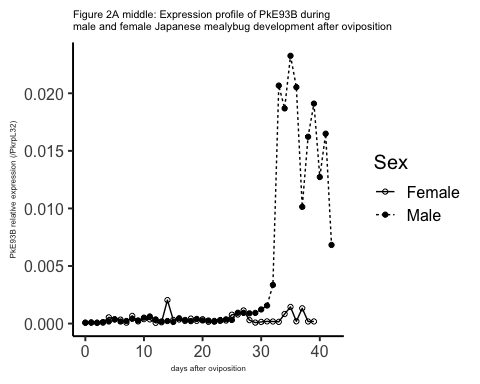
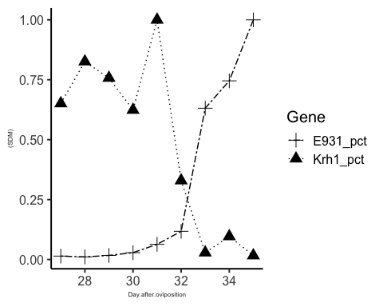

# Supplementary text: Materials and Methods - Figures expression profiles (A case of insect female neoteny: E93 expression and links to the juvenile hormone in mealybugs)
Isabelle Vea  
September 28, 2017  

#Supplementary information 2.3. RNA extraction and quantitative RT-PCR
This document provides the R command lines used to produce the figures for E93 study in the Japanese mealybug. (REF)

#Needed packages
- ggplot2
- plyr
- tidyr

#Files

- sample2profile-Krh1E93.csv: qPCR data for rpL32, Kr-h1 and E93 isoforms for male and female expression profiles
- E93-Pyr-male.csv: qPCR data of JHM treatment on males
- E93-Pyr-N3D0.csv: qPCR data on JHM treatment on females


```r
#if packages not installed
library(ggplot2)
library(plyr)
library(tidyr)
```


#Expression profile of E93 during the post-oviposition development of male and female mealybugs
We first examined the expression profiles of PkKr-h1 and three identified isoforms of PkE93.

```r
#loading file expression profile
setwd("/Users/isabelle/Dropbox/_Github_reps/E93/")
de<-read.csv(file="sample2profile-Krh1E93.csv",header = TRUE)
names(de)
```

```
##  [1] "cDNA.ID"               "previous.cDNA.."      
##  [3] "Sex"                   "Day.after.oviposition"
##  [5] "Stage"                 "rpL32"                
##  [7] "Kr.h1"                 "E93.1"                
##  [9] "E93.2"                 "E93.3"
```
This file includes the the second derivative maximum (SDM) values for Kr-h1, E93-1, E93-2, E93-3 and rpL32 used for expression profile analysis of males and females. The data was collected from RNA extraction performed on an independent sampling from a previous study on juvenile hormone variations in the Japanese mealybug (Vea et al., 2016 PLOS ONE):


##Kr-h1 expression between males and females (Figure S1)

```r
##Kr-h1 expression profile (Figure S1)
FigS1<-ggplot(de,aes(x=Day.after.oviposition, y=de$Kr.h1/de$rpL32, fill=Sex)) + 
  geom_point(aes(shape=Sex)) + 
  geom_line(aes(linetype=Sex) )+
  scale_shape_manual(values=c(16, 1))+ #shape of dots
  theme(panel.grid.major = element_blank(), panel.grid.minor = element_blank(), panel.background = element_blank(), axis.line = element_line(colour = "black"))+
  ylab("Kr-h1 relative expression (/rpL32)") +xlab("days after oviposition") +
  theme_classic(15) + 
  ggtitle("Figure S1: Expression profile of PkKr-h1 during\nmale and female Japanese mealybug development after oviposition")+
  theme(axis.title.x = element_text(colour = "#242424",size=6), plot.title = element_text(size=8),axis.title.y = element_text(colour = "#242424",size=6))
FigS1
```

<!-- -->
Our independent sampling showed a consistent expression pattern with the sampling carried out for Vea et al., 2016. PkKr-h1 expression shows a diverging expression when N2 start to differente between male and females. Male expression continues and drops later after the prepupal molt, while female N2 have their PkKr-h1 expression progressively decreasing, to remain unusually low until the adult molt.

##E93 isoform 1 (Figure 2A-top)

```r
##E93-1 expression profile (Figure 2A)
Fig2a1<-ggplot(de,aes(x=Day.after.oviposition, y=de$E93.1/de$rpL32, fill=Sex)) + 
  geom_point(aes(shape=Sex)) + 
  geom_line(aes(linetype=Sex) )+
  scale_shape_manual(values=c(16, 1))+
  theme(panel.grid.major = element_blank(), panel.grid.minor = element_blank(), panel.background = element_blank(), axis.line = element_line(colour = "black"))+
  ylab("E93-1 relative expression (/rpL32)") +xlab("days after oviposition") +
  theme_classic(15) + 
  ggtitle("Figure 2A: Expression profile of PkE93-1 during\nmale and female Japanese mealybug development after oviposition")+
  theme(axis.title.x = element_text(colour = "#242424",size=6), plot.title = element_text(size=8),axis.title.y = element_text(colour = "#242424",size=6))

Fig2a1
```

<!-- -->
PkE93-1 shows sexually dimorphic expression pattern starting from the middle of N2. PkE93-1 expression rapidly increases and peaks during the pupal stage, while in females, the levels are far lower, but with two small increases at the end of N2 and N3.


##E92 isoform 2 (Figure 2A-middle)

```r
##E93-2 expression profile (Figure S2)
Fig2a2<-ggplot(de,aes(x=Day.after.oviposition, y=de$E93.2/de$rpL32, fill=Sex)) + 
  geom_point(aes(shape=Sex)) + 
  geom_line(aes(linetype=Sex) )+
  scale_shape_manual(values=c(16, 1))+
  theme(panel.grid.major = element_blank(), panel.grid.minor = element_blank(), panel.background = element_blank(), axis.line = element_line(colour = "black"))+
  ylab("E93-2 relative expression (/rpL32)") +xlab("days after oviposition") +
  theme_classic(15) + 
  ggtitle("Figure 2A: Expression profile of PkE93-2 during\nmale and female Japanese mealybug development after oviposition")+
  theme(axis.title.x = element_text(colour = "#242424",size=6), plot.title = element_text(size=8),axis.title.y = element_text(colour = "#242424",size=6))

Fig2a2
```

<!-- -->
PkE93-2 shows similar patterns to PkE93-1.

##E92 isoform 3 (Fig 2A-bottom)

```r
#E93 -3 expression profile (Figure 2A)
Fig2a3<-ggplot(de,aes(x=Day.after.oviposition, y=de$E93.3/de$rpL32, fill=Sex)) + 
  geom_point(aes(shape=Sex)) + 
  geom_line(aes(linetype=Sex) )+
  scale_shape_manual(values=c(16, 1))+
  theme(panel.grid.major = element_blank(), panel.grid.minor = element_blank(), panel.background = element_blank(), axis.line = element_line(colour = "black"))+
  ylab("E93-3 relative expression (/rpL32)") +xlab("days after oviposition") +
  theme_classic(15) + 
  ggtitle("Figure 2A: Expression profile of PkE93-3 during\nmale and female Japanese mealybug development after oviposition")+
  theme(axis.title.x = element_text(colour = "#242424",size=6), plot.title = element_text(size=8),axis.title.y = element_text(colour = "#242424",size=6))

Fig2a3
```

<!-- -->
PkE93-3 has generally very low expression pattern but is expressed during embryogenesis and the differential expression is observed sexually at the end of development too.


#Comparison Kr-h1 and E93-1 (Figure 2B)

```r
head(de)
```

```
##   cDNA.ID previous.cDNA..  Sex Day.after.oviposition Stage  rpL32    Kr.h1
## 1    exp1              40 Male                     0   ED0 0.0188 3.40e-05
## 2    exp2              41 Male                     1   ED1 0.0111 4.73e-05
## 3    exp3              42 Male                     2   ED2 0.0218 1.22e-04
## 4    exp4              43 Male                     3   ED3 0.0362 1.96e-03
## 5    exp5              44 Male                     4   ED4 0.0279 1.18e-03
## 6    exp6              45 Male                     5   ED5 0.0298 3.06e-03
##      E93.1    E93.2    E93.3
## 1 6.23e-06 1.28e-06 4.44e-08
## 2 4.52e-06 8.95e-07 1.26e-07
## 3 4.64e-06 1.47e-06 3.08e-07
## 4 5.55e-05 4.80e-06 1.64e-06
## 5 3.30e-05 5.15e-06 1.31e-06
## 6 1.42e-04 1.05e-05 7.42e-06
```

```r
degather<-gather(de,Gene,SDM,7:10)
head(degather)
```

```
##   cDNA.ID previous.cDNA..  Sex Day.after.oviposition Stage  rpL32  Gene
## 1    exp1              40 Male                     0   ED0 0.0188 Kr.h1
## 2    exp2              41 Male                     1   ED1 0.0111 Kr.h1
## 3    exp3              42 Male                     2   ED2 0.0218 Kr.h1
## 4    exp4              43 Male                     3   ED3 0.0362 Kr.h1
## 5    exp5              44 Male                     4   ED4 0.0279 Kr.h1
## 6    exp6              45 Male                     5   ED5 0.0298 Kr.h1
##        SDM
## 1 3.40e-05
## 2 4.73e-05
## 3 1.22e-04
## 4 1.96e-03
## 5 1.18e-03
## 6 3.06e-03
```

```r
desub<-subset(degather, Gene=="Kr.h1"|Gene=="E93.1") #subset two genes
desub<-subset(desub, Day.after.oviposition >= 25) #just after N2

#with both male and female data 
Fig2B<-ggplot(desub,aes(x=Day.after.oviposition, y=(SDM/rpL32), fill=Gene)) + 
  geom_point(aes(shape=Gene)) + 
  geom_line(aes(linetype=Gene) )+
  facet_wrap(~Sex, scales="free",nrow=1) +
  scale_shape_manual(values=c(3, 17))+
  
  scale_linetype_manual(values=c("twodash", "dotted"))+
  theme(panel.grid.major = element_blank(), panel.grid.minor = element_blank(), panel.background = element_blank(), axis.line = element_line(colour = "black"))+
ylab("Comparison relative expression E93-1 and Kr-h1 in males (/rpL32)") +xlab("days after oviposition") +
  theme_classic(15) + 
  ggtitle("Figure 2B: Comparison of PkKr-h1 and PkE93-1\nafter N2 in males and females separately")+
 theme(axis.title.x = element_text(colour = "#242424",size=6), plot.title = element_text(size=8),axis.title.y = element_text(colour = "#242424",size=6))

Fig2B
```

<!-- -->


#PkKr-h1 and PkE93-2 (Figure S2)

```r
#Kr-h1 and E93-2 (Figure S2)
desub2<-subset(degather, Gene=="Kr.h1"|Gene=="E93.2") #subset two genes
desub2<-subset(desub2, Day.after.oviposition >= 25) #just after N2
#with both male and female data
FigS2<-ggplot(desub2,aes(x=Day.after.oviposition, y=(SDM/rpL32), fill=Gene)) + 
  geom_point(aes(shape=Gene)) + 
  geom_line(aes(linetype=Gene) )+
  facet_wrap(~Sex, scales="free",nrow=1) +
  scale_shape_manual(values=c(16, 1))+
  theme(panel.grid.major = element_blank(), panel.grid.minor = element_blank(), panel.background = element_blank(), axis.line = element_line(colour = "black"))+
ylab("Comparison relative expression E93-1 and Kr-h1 in males (/rpL32)") +xlab("days after oviposition") +
    ggtitle("Figure S2: Comparison of PkKr-h1 and PkE93-2\nafter N2 in males and females separately")+
  theme_classic(15) + 
  theme(axis.title.x = element_text(colour = "#242424",size=6), plot.title = element_text(size=8),axis.title.y = element_text(colour = "#242424",size=6))
FigS2
```

<!-- -->

#PkKr-h1 and PkE93-3 (Figure S3)

```r
#Kr-h1 and E93-3 (Figure S3)
desub3<-subset(degather, Gene=="Kr.h1"|Gene=="E93.3") #subset two genes
desub3<-subset(desub3, Day.after.oviposition >= 25) #just after N2

#with both male and female data
FigS3<-ggplot(desub3,aes(x=Day.after.oviposition, y=(SDM/rpL32), fill=Gene)) + 
  geom_point(aes(shape=Gene)) + 
  geom_line(aes(linetype=Gene) )+
  facet_wrap(~Sex, scales="free",nrow=1) +
  scale_shape_manual(values=c(16, 1))+
  theme(panel.grid.major = element_blank(), panel.grid.minor = element_blank(), panel.background = element_blank(), axis.line = element_line(colour = "black"))+
ylab("Comparison relative expression E93-1 and Kr-h1 in males (/rpL32)") +xlab("days after oviposition") +
  theme_classic(15) +
     ggtitle("Figure S3: Comparison of PkKr-h1 and PkE93-2\nafter N2 in males and females separately")+
  theme(axis.title.x = element_text(colour = "#242424",size=6), plot.title = element_text(size=8),axis.title.y = element_text(colour = "#242424",size=6))
FigS3
```

<!-- -->


#JH mimic treatments
JHM treatments were performed on both male and female and we assessed their effect on development and gene expression (see 2.4.JHM assays on male prepupae and female juvenile instars for details on the treatments)

##Effect of pyriproxyfen treatment on gene expression: data

```r
#loading file JHM treatment
#females
dtf<-read.csv(file="E93-Pyr-N3D0.csv",header = TRUE)
names(dtf)
```

```
##  [1] "cDNA.."          "Compound"        "treatment.stage"
##  [4] "sex"             "Day"             "DayL"           
##  [7] "N"               "rpL32"           "Kr.h1"          
## [10] "E93"             "PkE93.1"         "PkE93.2"        
## [13] "PkE93.3"         "br.1"            "br.2"           
## [16] "br.3"
```

```r
head(dtf)
```

```
##   cDNA.. Compound treatment.stage    sex Day DayL N   rpL32    Kr.h1
## 1    203  Control            N3D0 female   1    A 1 0.00281 4.22e-05
## 2    204  Control            N3D0 female   1    A 1 0.00405 6.70e-05
## 3    205  Control            N3D0 female   1    A 1 0.01160 9.58e-05
## 4    206  Control            N3D0 female   1    A 1 0.00519 7.69e-05
## 5    207    Mimic            N3D0 female   1    A 1 0.00281 9.39e-05
## 6    209    Mimic            N3D0 female   1    A 1 0.00161 3.51e-06
##        E93  PkE93.1  PkE93.2  PkE93.3     br.1     br.2     br.3
## 1 9.75e-06 1.77e-06 3.33e-07 6.94e-08 1.29e-06 3.91e-05 6.71e-05
## 2 1.81e-05 1.85e-06 3.36e-07 9.38e-08 1.01e-06 3.33e-05 2.80e-05
## 3 3.81e-05 5.16e-06 1.08e-06 1.44e-07 5.26e-06 8.94e-05 1.29e-04
## 4 2.78e-05 3.62e-06 5.92e-07 1.67e-07 4.03e-06 3.94e-05 9.86e-05
## 5 4.46e-05 1.59e-05 1.08e-06 2.39e-08 2.19e-06 1.28e-05 8.69e-05
## 6 4.14e-06 5.95e-07 1.22e-07 1.00e-07 6.68e-08 5.51e-06 4.13e-06
```

```r
dtf<-gather(dtf,Gene,SDM,9:16)
#dtf
head(dtf)
```

```
##   cDNA.. Compound treatment.stage    sex Day DayL N   rpL32  Gene      SDM
## 1    203  Control            N3D0 female   1    A 1 0.00281 Kr.h1 4.22e-05
## 2    204  Control            N3D0 female   1    A 1 0.00405 Kr.h1 6.70e-05
## 3    205  Control            N3D0 female   1    A 1 0.01160 Kr.h1 9.58e-05
## 4    206  Control            N3D0 female   1    A 1 0.00519 Kr.h1 7.69e-05
## 5    207    Mimic            N3D0 female   1    A 1 0.00281 Kr.h1 9.39e-05
## 6    209    Mimic            N3D0 female   1    A 1 0.00161 Kr.h1 3.51e-06
```

```r
dtf<-subset(dtf, Gene=="Kr.h1" | Gene=="PkE93.1"| Gene=="PkE93.2"| Gene=="PkE93.3")
dtf<-subset(dtf, Day == 4 |Day == 5 |Day == 6 |Day == 7 |Day == 8 )
dtf$Gene
```

```
##   [1] "Kr.h1"   "Kr.h1"   "Kr.h1"   "Kr.h1"   "Kr.h1"   "Kr.h1"   "Kr.h1"  
##   [8] "Kr.h1"   "Kr.h1"   "Kr.h1"   "Kr.h1"   "Kr.h1"   "Kr.h1"   "Kr.h1"  
##  [15] "Kr.h1"   "Kr.h1"   "Kr.h1"   "Kr.h1"   "Kr.h1"   "Kr.h1"   "Kr.h1"  
##  [22] "Kr.h1"   "Kr.h1"   "Kr.h1"   "Kr.h1"   "Kr.h1"   "Kr.h1"   "Kr.h1"  
##  [29] "Kr.h1"   "Kr.h1"   "Kr.h1"   "Kr.h1"   "Kr.h1"   "Kr.h1"   "Kr.h1"  
##  [36] "Kr.h1"   "Kr.h1"   "Kr.h1"   "Kr.h1"   "PkE93.1" "PkE93.1" "PkE93.1"
##  [43] "PkE93.1" "PkE93.1" "PkE93.1" "PkE93.1" "PkE93.1" "PkE93.1" "PkE93.1"
##  [50] "PkE93.1" "PkE93.1" "PkE93.1" "PkE93.1" "PkE93.1" "PkE93.1" "PkE93.1"
##  [57] "PkE93.1" "PkE93.1" "PkE93.1" "PkE93.1" "PkE93.1" "PkE93.1" "PkE93.1"
##  [64] "PkE93.1" "PkE93.1" "PkE93.1" "PkE93.1" "PkE93.1" "PkE93.1" "PkE93.1"
##  [71] "PkE93.1" "PkE93.1" "PkE93.1" "PkE93.1" "PkE93.1" "PkE93.1" "PkE93.1"
##  [78] "PkE93.1" "PkE93.2" "PkE93.2" "PkE93.2" "PkE93.2" "PkE93.2" "PkE93.2"
##  [85] "PkE93.2" "PkE93.2" "PkE93.2" "PkE93.2" "PkE93.2" "PkE93.2" "PkE93.2"
##  [92] "PkE93.2" "PkE93.2" "PkE93.2" "PkE93.2" "PkE93.2" "PkE93.2" "PkE93.2"
##  [99] "PkE93.2" "PkE93.2" "PkE93.2" "PkE93.2" "PkE93.2" "PkE93.2" "PkE93.2"
## [106] "PkE93.2" "PkE93.2" "PkE93.2" "PkE93.2" "PkE93.2" "PkE93.2" "PkE93.2"
## [113] "PkE93.2" "PkE93.2" "PkE93.2" "PkE93.2" "PkE93.2" "PkE93.3" "PkE93.3"
## [120] "PkE93.3" "PkE93.3" "PkE93.3" "PkE93.3" "PkE93.3" "PkE93.3" "PkE93.3"
## [127] "PkE93.3" "PkE93.3" "PkE93.3" "PkE93.3" "PkE93.3" "PkE93.3" "PkE93.3"
## [134] "PkE93.3" "PkE93.3" "PkE93.3" "PkE93.3" "PkE93.3" "PkE93.3" "PkE93.3"
## [141] "PkE93.3" "PkE93.3" "PkE93.3" "PkE93.3" "PkE93.3" "PkE93.3" "PkE93.3"
## [148] "PkE93.3" "PkE93.3" "PkE93.3" "PkE93.3" "PkE93.3" "PkE93.3" "PkE93.3"
## [155] "PkE93.3" "PkE93.3"
```

```r
dtf$Day
```

```
##   [1] 4 4 4 4 4 4 5 5 5 5 5 5 6 6 6 6 6 6 7 7 7 7 7 7 8 8 8 8 8 8 8 8 8 8 8
##  [36] 8 8 8 8 4 4 4 4 4 4 5 5 5 5 5 5 6 6 6 6 6 6 7 7 7 7 7 7 8 8 8 8 8 8 8
##  [71] 8 8 8 8 8 8 8 8 4 4 4 4 4 4 5 5 5 5 5 5 6 6 6 6 6 6 7 7 7 7 7 7 8 8 8
## [106] 8 8 8 8 8 8 8 8 8 8 8 8 4 4 4 4 4 4 5 5 5 5 5 5 6 6 6 6 6 6 7 7 7 7 7
## [141] 7 8 8 8 8 8 8 8 8 8 8 8 8 8 8 8
```

```r
#males
dtm<-read.csv(file="E93-Pyr-male.csv",header = TRUE)
names(dtm)
```

```
## [1] "Sample.ID" "treatment" "Day"       "DayL"      "Gene"      "SDM.Gene" 
## [7] "SDM.rpL32"
```

```r
head(dtm)
```

```
##   Sample.ID treatment Day DayL  Gene SDM.Gene SDM.rpL32
## 1       299   Control   1    A Kr-h1 3.91e-05   0.00116
## 2       300   Control   2    B Kr-h1 1.05e-05   0.00148
## 3       301   Control   3    C Kr-h1 2.82e-06   0.00221
## 4       302   Control   4    D Kr-h1 3.03e-06   0.00206
## 5       303   Control   4    D Kr-h1 7.78e-06   0.00238
## 6       304     Mimic   4    D Kr-h1 1.50e-04   0.00197
```

```r
dtm<-subset(dtm, Gene=="Kr-h1" | Gene=="PkE93-1"| Gene=="PkE93-2"| Gene=="PkE93-3")
dtm$Gene
```

```
##   [1] Kr-h1   Kr-h1   Kr-h1   Kr-h1   Kr-h1   Kr-h1   Kr-h1   Kr-h1  
##   [9] Kr-h1   Kr-h1   Kr-h1   Kr-h1   Kr-h1   Kr-h1   Kr-h1   Kr-h1  
##  [17] Kr-h1   Kr-h1   Kr-h1   Kr-h1   Kr-h1   Kr-h1   Kr-h1   Kr-h1  
##  [25] Kr-h1   Kr-h1   Kr-h1   Kr-h1   Kr-h1   Kr-h1   Kr-h1   Kr-h1  
##  [33] Kr-h1   Kr-h1   Kr-h1   Kr-h1   Kr-h1   Kr-h1   Kr-h1   Kr-h1  
##  [41] Kr-h1   Kr-h1   Kr-h1   Kr-h1   PkE93-1 PkE93-1 PkE93-1 PkE93-1
##  [49] PkE93-1 PkE93-1 PkE93-1 PkE93-1 PkE93-1 PkE93-1 PkE93-1 PkE93-1
##  [57] PkE93-1 PkE93-1 PkE93-1 PkE93-1 PkE93-1 PkE93-1 PkE93-1 PkE93-1
##  [65] PkE93-1 PkE93-1 PkE93-1 PkE93-1 PkE93-1 PkE93-1 PkE93-1 PkE93-1
##  [73] PkE93-1 PkE93-1 PkE93-1 PkE93-1 PkE93-1 PkE93-1 PkE93-1 PkE93-1
##  [81] PkE93-1 PkE93-1 PkE93-1 PkE93-1 PkE93-1 PkE93-1 PkE93-1 PkE93-1
##  [89] PkE93-2 PkE93-2 PkE93-2 PkE93-2 PkE93-2 PkE93-2 PkE93-2 PkE93-2
##  [97] PkE93-2 PkE93-2 PkE93-2 PkE93-2 PkE93-2 PkE93-2 PkE93-2 PkE93-2
## [105] PkE93-2 PkE93-2 PkE93-2 PkE93-2 PkE93-2 PkE93-2 PkE93-2 PkE93-2
## [113] PkE93-2 PkE93-2 PkE93-2 PkE93-2 PkE93-2 PkE93-2 PkE93-2 PkE93-2
## [121] PkE93-2 PkE93-2 PkE93-2 PkE93-2 PkE93-2 PkE93-2 PkE93-2 PkE93-2
## [129] PkE93-2 PkE93-2 PkE93-2 PkE93-2 PkE93-3 PkE93-3 PkE93-3 PkE93-3
## [137] PkE93-3 PkE93-3 PkE93-3 PkE93-3 PkE93-3 PkE93-3 PkE93-3 PkE93-3
## [145] PkE93-3 PkE93-3 PkE93-3 PkE93-3 PkE93-3 PkE93-3 PkE93-3 PkE93-3
## [153] PkE93-3 PkE93-3 PkE93-3 PkE93-3 PkE93-3 PkE93-3 PkE93-3 PkE93-3
## [161] PkE93-3 PkE93-3 PkE93-3 PkE93-3 PkE93-3 PkE93-3 PkE93-3 PkE93-3
## [169] PkE93-3 PkE93-3 PkE93-3 PkE93-3 PkE93-3 PkE93-3 PkE93-3 PkE93-3
## Levels: Kr-h1 PkE93-1 PkE93-2 PkE93-3
```

```r
#subsetting from D3 to D6
dtm<-subset(dtm, Day == 3| Day == 4| Day == 5| Day == 6)
dtm$Day
```

```
##   [1] 3 4 4 4 4 6 5 5 5 5 5 5 5 5 5 5 5 5 4 4 6 6 6 4 4 6 6 3 3 3 3 3 3 4 4
##  [36] 4 4 6 5 5 5 5 5 5 5 5 5 5 5 5 4 4 6 6 6 4 4 6 6 3 3 3 3 3 3 4 4 4 4 6
##  [71] 5 5 5 5 5 5 5 5 5 5 5 5 4 4 6 6 6 4 4 6 6 3 3 3 3 3 3 4 4 4 4 6 5 5 5
## [106] 5 5 5 5 5 5 5 5 5 4 4 6 6 6 4 4 6 6 3 3 3 3 3
```


Graphs of the effect of JHM treatments on Kr-h1 and E93 gene expression and statistical tests were obtained using the transformed data (see statistical analysis file for more details [add a link to the file after github upload]).


```r
#Fig 3A: male normalized data by rpL32 transformed by log 10
dtmlogbox <- ggplot(dtm,aes(x=DayL,y=log10(SDM.Gene/SDM.rpL32))) + geom_boxplot(width=0.5, size=0.2, outlier.size = 0.1, aes(fill=treatment)) + 
  facet_wrap(~Gene,scales="free",nrow=2) + 
  theme_classic(base_size = 12) +
  ggtitle("Figure 3A: Effect of JHM treatment on Kr-h1\nand E93 expression in males transformed by log 10")+
  scale_fill_manual(name="", # Legend label, use darker colors
                  breaks=c("Control", "Mimic"),
                  labels=c("CT","5 mM"),
                  values=c("white", "grey")) +

  theme(strip.background=element_rect(fill="black"))+ 
  theme(strip.text=element_text(color="white", face="bold"))

dtmlogbox
```

<!-- -->


```r
#Fig 3B: females absolute values normalized by rpL32 and transformed by log10
dtflogbox <- ggplot(dtf,aes(x=DayL,y=log10(SDM/rpL32))) + geom_boxplot(width=0.5, size=0.2, outlier.size = 0.1, aes(fill=Compound)) + 
  facet_wrap(~Gene, scales="free",nrow=2) + 
  theme_classic(base_size = 12) +
  scale_fill_manual(name="", # Legend label, use darker colors
                  breaks=c("Control", "Mimic"),
                  labels=c("CT","20 mM"),
                  values=c("white", "grey")) +
  ggtitle("Figure 3B: Effect of JHM treatment on Kr-h1 and\nE93 expression in females transformed log10")+
  theme(strip.background=element_rect(fill="black"))+ 
  theme(strip.text=element_text(color="white", face="bold"))

dtflogbox
```

<!-- -->
